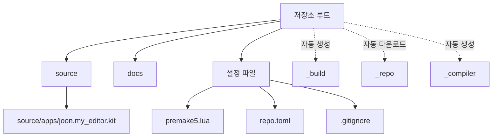
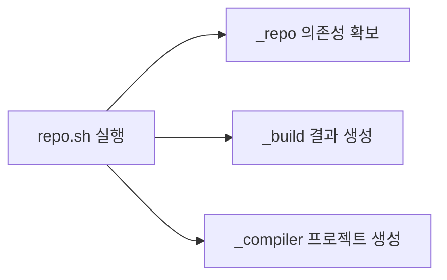

# 디렉토리 지도

완전한 소스 코드 저장소라기보다, Kit 앱을 만들기 위한 템플릿 + 도구 + 생성된 앱 묶음.

## 큰 구조

```text
kit-app-template/
├─ source/                 내가 만든 앱/Extension
├─ templates/              새 앱/Extension 생성 재료
├─ tools/                  repo tool, packman, dependency 설정
├─ readme-assets/          이미지, 추가 설명 문서
├─ _repo/                  내려받은 repo tool 의존성
├─ _build/                 빌드 결과물
├─ _compiler/              생성된 빌드 프로젝트
├─ docs/                   한국어 이해 문서
├─ repo.sh / repo.bat      작업 진입점
├─ repo.toml               전체 도구 설정
├─ repo_tools.toml         repo tool 확장 설정
└─ premake5.lua            빌드 대상 앱 등록
```

## 폴더 역할 한눈에

| 경로 | 역할 | 직접 수정 |
|---|---|---|
| `source/` | 실제 프로젝트 코드 | 자주 |
| `source/apps/` | 실행 가능한 `.kit` 앱 정의 | 자주 |
| `templates/` | 앱/Extension 생성용 템플릿 | 가끔 |
| `tools/deps/` | Kit SDK, pip, 사용자 dependency 설정 | 가끔 |
| `tools/packman/` | NVIDIA 패키지 다운로드 도구 | 거의 안 함 |
| `tools/repoman/` | repo tool 실행 보조 | 거의 안 함 |
| `readme-assets/` | README 이미지와 보조 문서 | 필요할 때 |
| `_repo/` | repo tool이 받은 내부 의존성 | 수정 안 함 |
| `_build/` | 빌드 결과, 캐시, 실행 파일 | 수정 안 함 |
| `_compiler/` | 생성된 프로젝트 파일 | 수정 안 함 |
| `.vscode/` | VS Code 설정/작업 | 필요할 때 |

## 직접 관리 영역



## `source/`

현재 생성된 앱:

```text
source/
├─ apps/
│  └─ joon.my_editor.kit
├─ extensions/
│  └─ joon.smartfarm.twin/
└─ rendered_template_metadata.json
```

| 파일 | 역할 |
|---|---|
| `joon.my_editor.kit` | 앱 이름 `joon`, 버전 `0.1.0`, 필요한 Extension 목록 |
| `joon.smartfarm.twin` | Python UI Extension 템플릿에서 생성된 예제 |
| `rendered_template_metadata.json` | template tool이 남긴 생성 기록 |

## `source/extensions/joon.smartfarm.twin`

```text
source/extensions/joon.smartfarm.twin/
├─ config/extension.toml
├─ joon/smartfarm/twin/extension.py
├─ data/icon.png
├─ data/preview.png
├─ docs/
└─ premake5.lua
```

| 파일 | 역할 |
|---|---|
| `config/extension.toml` | Extension 메타데이터, 의존성, Python 모듈 이름 |
| `extension.py` | `Smart Farm Twin` 창, 씬 생성/데모 시나리오 버튼 |
| `data/` | Extension Manager 표시용 아이콘/미리보기 |
| `premake5.lua` | Extension 빌드 설정 |

## `templates/`

새로운 앱/Extension을 만들 때 복사되는 원본.

```text
templates/
├─ apps/
│  ├─ kit_base_editor/       기본 3D 에디터
│  ├─ kit_service/           UI 없는 서비스
│  ├─ usd_composer/          USD 저작/구성
│  ├─ usd_explorer/          큰 USD 씬 탐색
│  ├─ usd_viewer/            뷰어/스트리밍
│  └─ streaming_configs/     스트리밍 레이어
└─ extensions/
   ├─ basic_python/
   ├─ python_ui/
   ├─ basic_cpp/
   ├─ basic_python_binding/
   └─ *.setup/
```

## `_`로 시작하는 폴더



| 폴더 | 성격 |
|---|---|
| `_repo/` | 도구 의존성 |
| `_build/` | 빌드 산출물 |
| `_compiler/` | 빌드 시스템 산출물 |

Git 커밋 제외 대상.

## 수정 기준

```text
내 앱 기능 추가      -> source/
앱 의존성 변경      -> source/apps/*.kit
Extension 기능 변경 -> source/extensions/*
빌드 대상 추가      -> premake5.lua
SDK/패키징 조정     -> repo.toml
새 템플릿 만들기    -> templates/
사용법 기록         -> docs/
```
