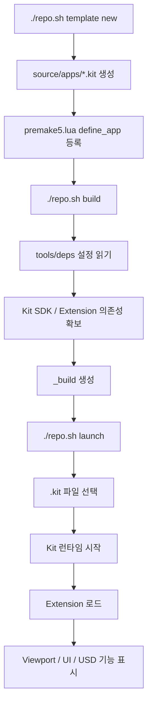
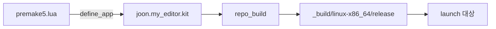
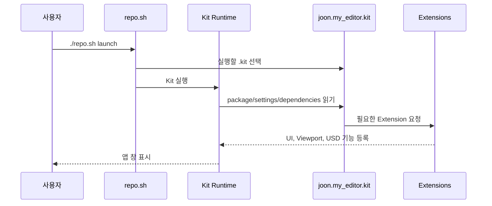

# 빌드와 실행 흐름

`repo.sh` 하나가 대부분의 작업 진입점.

Linux 기준 `./repo.sh`, Windows 기준 `.\repo.bat`.

## 전체 흐름



## 명령별 역할

| 명령 | 하는 일 | 결과 |
|---|---|---|
| `./repo.sh template new` | 템플릿 선택, 앱/Extension 생성 | `source/` 파일 증가 |
| `./repo.sh build` | 앱 빌드, 의존성 수집 | `_build/` 생성/갱신 |
| `./repo.sh launch` | 앱 실행 | Kit 창 실행 |
| `./repo.sh test` | 테스트 실행 | 테스트 결과 |
| `./repo.sh package` | 배포 패키지 생성 | zip 등 패키지 |

## 현재 앱 빌드 연결



현재 등록:

```lua
define_app("joon.my_editor.kit")
```

## 실행 때 읽히는 정보



## `.kit` 파일의 핵심 블록

| 블록 | 의미 |
|---|---|
| `[package]` | 앱 이름, 버전, 설명 |
| `[dependencies]` | 켤 Extension 목록 |
| `[settings]` | 렌더러, 텔레메트리, 창, 앱 동작 |
| `[settings.app.exts]` | Extension 검색 경로 |
| `[[test]]` | 테스트 실행 옵션 |
| `[template]` | template tool 메타데이터 |

## 초반 실행이 느린 이유

```text
첫 실행
  -> Kit SDK 의존성 확인
  -> Extension 다운로드/캐시
  -> RTX shader compile
  -> 앱 창 표시

다음 실행
  -> 캐시 재사용
  -> 더 빠른 시작
```

## 자주 보는 문제 위치

| 증상 | 먼저 볼 곳 |
|---|---|
| 앱 목록에 안 보임 | `premake5.lua`의 `define_app` |
| Extension 로드 실패 | `.kit`의 `[dependencies]` |
| 빌드 실패 | `repo.toml`, `tools/deps/` |
| 실행 중 창/Viewport 문제 | `.kit`의 `[settings]` |
| 패키징 결과 이상 | `repo.toml`의 `[repo_package]` |
