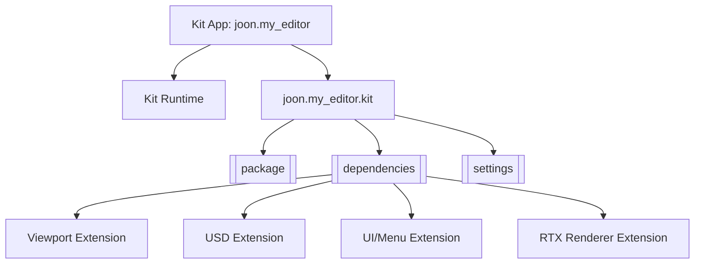
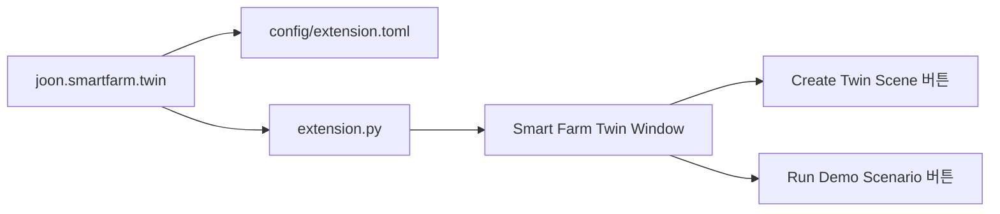
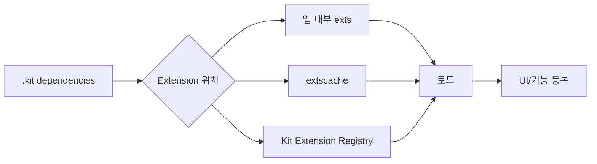
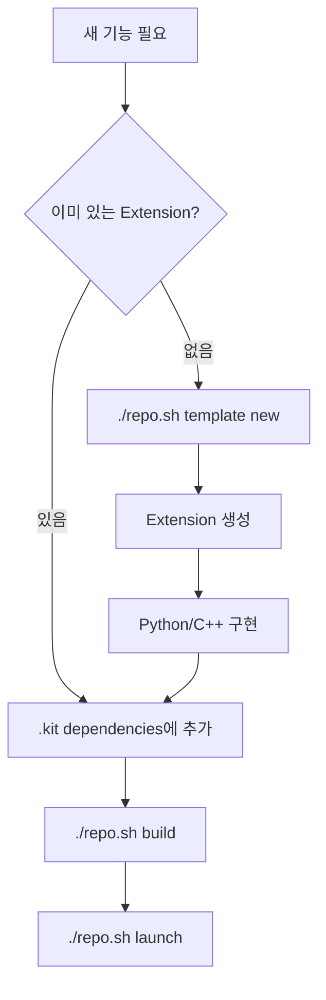

# Kit 앱과 Extension

Omniverse Kit 앱 = 작은 코어 + 여러 Extension 조합.

`.kit` 파일 = 그 조합을 적는 설정 파일.

## 개념 그림



## 앱과 Extension 차이

| 구분 | 앱 | Extension |
|---|---|---|
| 역할 | 실행되는 프로그램 껍데기 | 기능 단위 |
| 파일 | `source/apps/*.kit` | `source/extensions/*` 또는 registry |
| 예시 | `joon.my_editor` | `omni.kit.viewport.window` |
| 수정 위치 | `.kit` settings/dependencies | Python/C++/config |

## 현재 앱

```text
앱 파일: source/apps/joon.my_editor.kit
표시 이름: joon
기반 템플릿: kit_base_editor
목적: 기본 OpenUSD 3D 에디터
```

## 현재 생성된 Extension

```text
Extension: joon.smartfarm.twin
표시 이름: Smart Farm Twin
기반 템플릿: Python UI Extension
주요 파일: source/extensions/joon.smartfarm.twin/joon/smartfarm/twin/extension.py
현재 상태: 앱 .kit dependencies에 연결됨
목적: 딸기 스마트팜 디지털 트윈 POC 제어 패널
```



## 현재 앱이 켜는 주요 Extension

| Extension | 역할 |
|---|---|
| `omni.kit.viewport.window` | 실제 3D Viewport 창 |
| `omni.hydra.rtx` | RTX 렌더러 |
| `omni.kit.window.stage` | Stage 트리 |
| `omni.kit.window.property` | 속성 패널 |
| `omni.kit.window.content_browser` | Content Browser |
| `omni.kit.menu.file/edit/create` | 기본 메뉴 |
| `omni.kit.material.library` | 재질 라이브러리 |
| `omni.kit.developer.bundle` | 개발자 도구 |
| `omni.physx.stageupdate` | 물리 런타임 |
| `omni.warp.core` | Warp 지원 |

## Extension 로딩 방식



`.kit` 안 검색 경로:

```toml
[settings.app.exts]
folders.'++' = [
    "${app}/../exts",
    "${app}/../extscache/"
]
```

## 새 기능 추가 흐름



현재 `joon.smartfarm.twin`은 앱 시작 때 자동으로 켜지도록 연결됨:

```toml
[dependencies]
"joon.smartfarm.twin" = {}
```

위치:

```text
source/apps/joon.my_editor.kit
```

## Python Extension 기본 모양

```text
source/extensions/my_company.my_extension/
├─ config/extension.toml
├─ my_company/my_extension/
│  ├─ __init__.py
│  └─ extension.py
├─ data/
└─ docs/
```

| 파일 | 역할 |
|---|---|
| `config/extension.toml` | Extension 이름, 버전, 의존성 |
| `extension.py` | 시작/종료 로직 |
| `data/` | 아이콘, 이미지, 리소스 |
| `docs/` | Extension 설명 |

## `.kit` 수정 감각

```text
창 제목 변경       -> [settings.app] window.title
앱 이름 변경       -> [package] title, [settings.app.environment]
기능 켜기          -> [dependencies]에 Extension 추가
기능 끄기          -> [dependencies]에서 제거
초기 Viewport 설정 -> [settings.app.viewport.defaults]
```

## 주의

```text
[dependencies]는 기능 스위치
[settings]는 동작 옵션
generated part는 버전 잠금
수동 수정 전 백업 또는 git commit 추천
```
