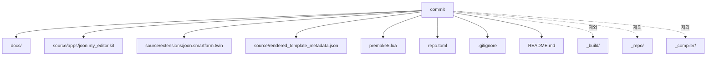

# Git 작업 흐름

목표 저장소:

```text
https://github.com/SJoon99/Creative-Self-Motivating.git
```

## 현재 저장소 상태 이해

이 폴더는 NVIDIA `kit-app-template`에서 시작한 git 저장소.

원래 `origin`:

```text
https://github.com/NVIDIA-Omniverse/kit-app-template.git
```

프로젝트용 원격으로 바꿀 대상:

```text
https://github.com/SJoon99/Creative-Self-Motivating.git
```

## 커밋에 들어가야 하는 것



## 기본 명령

```bash
git status
git add README.md docs .gitignore premake5.lua repo.toml source
git commit -m "first commit"
git branch -M main
git remote set-url origin https://github.com/SJoon99/Creative-Self-Motivating.git
git push -u origin main
```

`origin`이 없을 때만:

```bash
git remote add origin https://github.com/SJoon99/Creative-Self-Motivating.git
```

## 왜 `source/` 포함?

```text
premake5.lua
  -> define_app("joon.my_editor.kit")
  -> source/apps/joon.my_editor.kit 필요
```

`source/`가 빠지면:

```text
clone 받은 사람
  -> build
  -> joon.my_editor.kit 없음
  -> 앱 빌드/실행 실패
```

## 커밋 제외 기준

| 제외 | 이유 |
|---|---|
| `_build/` | 빌드 결과, 큼, 다시 생성 가능 |
| `_repo/` | 도구 의존성, 다시 다운로드 가능 |
| `_compiler/` | 생성된 프로젝트 파일 |
| `.cache/`, `.local/` | 로컬 환경 파일 |
| `*.etli` | 스트리밍 trace |

## 협업 전 추천 루틴


## 작은 변경 단위

```text
docs만 수정       -> docs: ...
앱 설정 수정      -> app: ...
Extension 추가    -> ext: ...
빌드 설정 변경    -> build: ...
```
