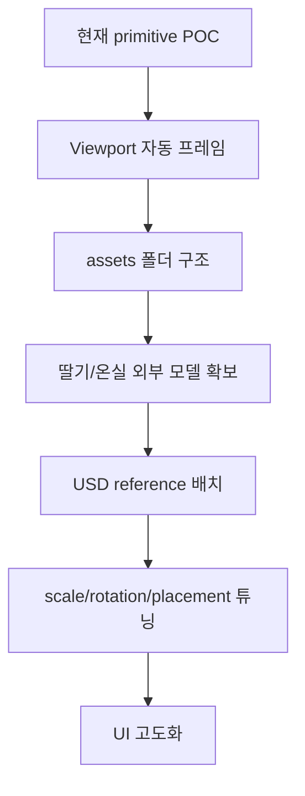

# 스마트팜 트윈 POC 진행 현황 - 2026-05-21

## 한 줄 요약

`Smart Farm Twin` 버튼 UI + OpenUSD 기반 비닐하우스 POC 씬 + 데모 시나리오 반영까지 완료

```mermaid
flowchart LR
    A[앱 실행] --> B[Smart Farm Twin UI]
    B --> C[Create Twin Scene]
    C --> D[/World/SmartFarm 생성]
    B --> E[Run Demo Scenario]
    E --> F[UI 지표 갱신]
    E --> G[LED/CO2/식물 상태 변화]
```

## 현재 상태

| 구분 | 상태 | 메모 |
|---|---:|---|
| Kit 앱 | 완료 | `joon.my_editor` |
| Extension 연결 | 완료 | `joon.smartfarm.twin` 자동 로드 |
| UI 패널 | 1차 완료 | 기능 확인용 |
| 트윈 씬 생성 | 1차 완료 | primitive 기반 |
| 데모 시나리오 | 1차 완료 | 조기출하 추천 흐름 |
| 현실적 3D 모델 | 미완료 | 외부 asset 필요 |
| 자동 카메라/프레이밍 | 미완료 | 다음 개선 후보 |

## 코드 위치

```text
source/
├─ apps/
│  └─ joon.my_editor.kit
│     └─ joon.smartfarm.twin dependency 연결
│
└─ extensions/
   └─ joon.smartfarm.twin/
      ├─ config/extension.toml
      │  └─ omni.usd dependency 추가
      │
      └─ joon/smartfarm/twin/
         ├─ extension.py
         │  ├─ UI 생성
         │  ├─ SmartFarm USD scene 생성
         │  └─ Demo scenario 적용
         │
         └─ tests/test_hello_world.py
            └─ UI 버튼 + USD prim 생성 테스트
```

## UI 구성

```text
Smart Farm Twin
├─ Project: Strawberry Early-Shipment Twin
├─ Facility: Single-span greenhouse
├─ Crop: Seolhyang strawberry
├─ Stage
├─ Target Shipment
├─ Scenario
├─ Expected Shipment
├─ Yield Score
├─ OpEx Delta
├─ Recommendation
│
├─ [Create Twin Scene]
└─ [Run Demo Scenario]
```

## Create Twin Scene

버튼 클릭 시 생성되는 USD 구조

```text
/World/SmartFarm
├─ Greenhouse
│  ├─ 투명 side cover
│  ├─ 아치형 roof cover
│  ├─ 반복 rib frame
│  └─ long beam
│
├─ GrowingBeds
│  ├─ Bed_01 ~ Bed_08
│  ├─ SoilTop_01 ~ SoilTop_08
│  ├─ IrrigationPipe_01 ~ IrrigationPipe_08
│  └─ SoilClump_*
│
├─ Plants
│  └─ 64개 딸기 식물 proxy
│     ├─ Stem
│     ├─ Leaf_01 ~ Leaf_04
│     ├─ LeafCluster
│     ├─ Flower
│     └─ Fruit
│
├─ Actuators
│  ├─ LEDStrip_01 ~ LEDStrip_04
│  ├─ VentFan_01 ~ VentFan_02
│  ├─ CO2Injector
│  └─ WaterValve
│
├─ Sensors
│  ├─ TemperatureHumiditySensor
│  ├─ CO2Sensor
│  ├─ LightSensor
│  └─ SoilMoistureSensor
│
└─ Lighting
   ├─ SoftSky
   └─ Sun
```

## Run Demo Scenario

목표: `12/22 조기출하 가능성`을 트윈에서 시각적으로 보여주기

| 항목 | 실행 전 | 실행 후 |
|---|---|---|
| Stage | Vegetative growth | Fruiting -> Early harvest |
| Scenario | Not run | 16h photoperiod + CO2 |
| Expected Shipment | - | 2026-12-22 |
| Yield Score | - | 87 / 100 |
| OpEx Delta | - | +18% electricity |
| Recommendation | - | Recommended |

씬 변화

```text
LED strip      노란색 강조 + 두께 증가
CO2 injector   파란색 강조
CO2 sensor     파란색 강조
딸기 식물       잎 크기 증가 + 열매 추가/강조
```

## 지금 보이는 한계

```text
현실감 부족
├─ 식물: primitive proxy
├─ 온실: cube 조합 아치형 근사
└─ 재질: 실제 texture 없음

조작감 문제
├─ viewport 이동 속도에 따라 작게 느껴짐
├─ 자동 frame 없음
└─ 외부 camera prim은 제거했지만 기본 view 보정 필요

asset 문제
├─ 실제 딸기 모델 없음
├─ 실제 온실 모델 없음
└─ glTF/FBX/USD import pipeline 미구현
```

## 검증 완료

```bash
python3 -m py_compile \
  source/extensions/joon.smartfarm.twin/joon/smartfarm/twin/extension.py \
  source/extensions/joon.smartfarm.twin/joon/smartfarm/twin/tests/test_hello_world.py

./repo.sh build
./repo.sh test
```

테스트 확인 범위

| 테스트 | 확인 내용 |
|---|---|
| startup | extension 로드 |
| UI button | 버튼 탐색 |
| scene create | `/World/SmartFarm` 생성 |
| greenhouse | 아치형 roof prim 생성 |
| beds | bed + soil top 생성 |
| plants | leaf/fruit prim 생성 |
| scenario | 데모 상태 문구 변경 |

## 다음 작업 추천



우선순위

1. `/World/SmartFarm` 자동 선택 + viewport frame
2. `assets/` 폴더 추가
3. 외부 모델 loader 구현
4. 실제 딸기 plant 모델 1개 배치 후 복제
5. 실제 greenhouse 모델 또는 더 정교한 mesh 적용

## 외부 asset 기준

권장 포맷

```text
1순위: USD / USDA / USDC
2순위: GLB / glTF
3순위: FBX
4순위: OBJ
```

라이선스 우선순위

```text
1순위: CC0
2순위: 교육 목적 허용
3순위: CC BY, 출처 명시 가능할 때만
비추천: NonCommercial / 불명확한 무료 모델
```
