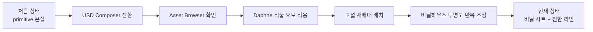
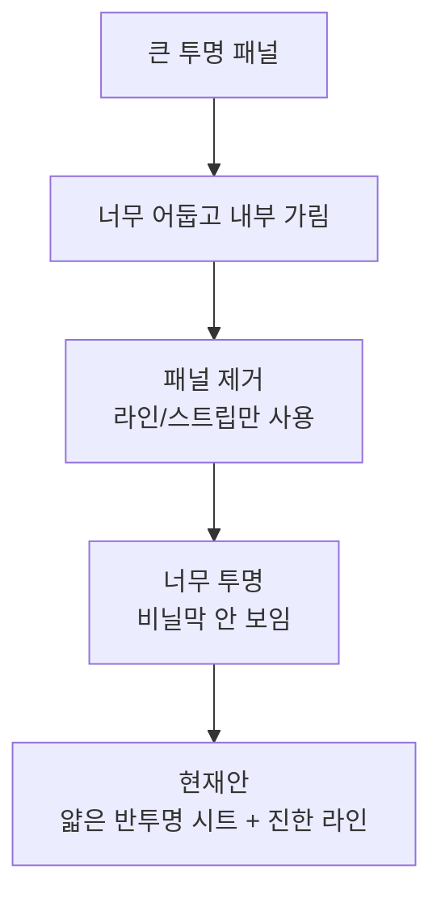
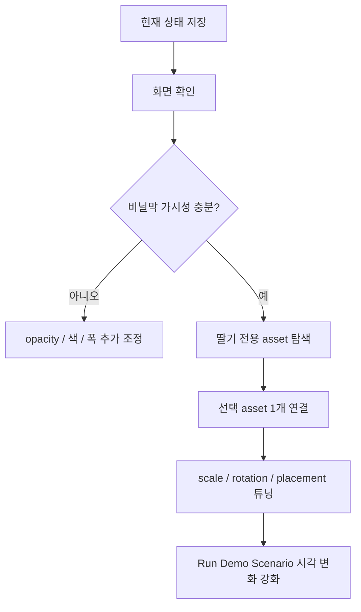

# 비닐하우스 시각 고도화 기록 - 2026-05-22

## 한 줄 상태

```text
USD Composer 기반 Smart Farm Twin
  -> 비닐하우스 + 고설 딸기 재배대 + Daphne 기반 식물 후보
  -> POC용 화면 확인 가능
  -> realism은 아직 반복 튜닝 단계
```



## 오늘 진행

| 구분 | 진행 | 현재 판단 |
|---|---|---|
| 실행 앱 | USD Composer 기반 앱 사용 | asset 탐색 가능 |
| 식물 asset | NVIDIA Asset Browser의 Daphne 우선 사용 | 딸기 전용 아님, 임시 후보 |
| 식물 scale | `0.020, 0.020, 0.020` | 과대 크기 완화 |
| 식물 방향 | 누워 보이던 문제 보정 | `rotation=(-90, y, 0)` 적용 |
| 재배 방식 | 바닥 식재 -> 고설 재배대 | 사진 레퍼런스와 가까움 |
| 비닐하우스 | 큰 투명 패널 + 라인 조합 | 아직 화면 확인 필요 |
| UI | 기본 상태 유지 | 지금은 씬 POC 우선 |

## 현재 씬 구조

```text
/World/SmartFarm
├─ Greenhouse
│  ├─ LeftWallVinylSheet
│  ├─ RightWallVinylSheet
│  ├─ FrontVinylSheet
│  ├─ BackVinylSheet
│  ├─ VinylRoofSheet_*
│  ├─ VinylRoofFilm_*
│  ├─ VinylSideFilm_*
│  ├─ VinylSeam_*
│  ├─ Rib_*_Post
│  ├─ Rib_*_Arch
│  └─ LongBeam_*
│
├─ GrowingBeds
│  ├─ WhiteRaisedGutter_01~04
│  ├─ SoilTop_01~04
│  ├─ IrrigationPipe_01~04
│  └─ Support_*
│
├─ Plants
│  └─ Bed_XX_Plant_XX
│     ├─ ExternalModel          Daphne reference 후보
│     ├─ HangingRunner          딸기 줄기 proxy
│     ├─ Fruit                  빨간 열매 proxy
│     └─ Fruit_Unripe           미성숙 열매 proxy
│
├─ Sensors
├─ Actuators
└─ Lighting
```

## 비닐하우스 표현 변화

처음 의도:

```text
비닐하우스
  -> 내부가 잘 보여야 함
  -> 빛이 거의 투과되는 느낌
  -> 단, 비닐막 존재감은 보여야 함
```

반복 결과:



현재 코드 기준:

```text
비닐 시트
├─ 측면: opacity 0.28
├─ 전후면: opacity 0.22
└─ 지붕: opacity 0.26

비닐 라인
├─ 측면 라인: opacity 0.66
├─ 지붕 라인: opacity 0.62
├─ seam: opacity 0.68
└─ end outline: opacity 0.58~0.70
```

시각 목표:

```text
정면/측면에서
  -> 내부 식물 보임
  -> 비닐하우스 외곽 보임
  -> 지붕에 비닐막/라인 느낌 보임
  -> 검은 벽처럼 보이지 않음
```

## 식물 asset 진행

현재 우선순위:

```text
1순위
  NVIDIA Asset Browser Daphne.usd

2순위
  local assets/daphne.usd
  local assets/Daphne.usd

3순위
  assets/strawberry_plant.usd / usda / usdc

4순위
  official asset pack 내부 shrub 후보
```

현재 판단:

```text
Daphne
  장점: 실제 mesh, 잎 밀도 있음, 바로 보임
  단점: 딸기 작물 아님, 크라운/런너/딸기 형태 부정확

딸기 POC 보완
  Daphne 위에 proxy fruit 추가
  HangingRunner cylinder 추가
  고설 재배대 옆으로 열매 내려오게 배치
```

## 실행/확인 방법

```bash
cd /home/joon/kit-app-template
./usecomposer.sh
```

앱 안에서:

```text
Smart Farm Twin 창
  -> Create Twin Scene 클릭
  -> 씬 새로 생성
  -> Stage에서 /World/SmartFarm 확인
```

주의:

```text
코드 수정 후
  기존 씬 자동 갱신 아님
  Create Twin Scene 다시 클릭 필요

USD Composer 실행 중이면
  extension reload 또는 앱 재시작 권장
```

## 검증 완료

```bash
python3 -m py_compile \
  source/extensions/joon.smartfarm.twin/joon/smartfarm/twin/extension.py

./repo.sh build
```

결과:

```text
py_compile 통과
BUILD RELEASE SUCCEEDED
```

## 현재 한계

```text
식물 realism
  Daphne는 딸기 전용 asset 아님
  실제 딸기 잎/꽃/열매 mesh 필요

비닐 material
  UsdPreviewSurface opacity 기반
  실제 thin plastic shader 아님
  RTX에서 각도/조명에 따라 보이는 정도 달라짐

온실 형태
  cube 조합의 POC 구조
  실제 hoop house 곡면 구조 아님

성능
  식물 reference 반복 배치
  instanceable=True 적용했지만 asset 무게 확인 필요
```

## 다음에 이어갈 작업



우선순위:

```text
1. 현재 비닐막 버전 눈으로 재확인
2. 딸기 전용 USD / FBX / OBJ 후보 선정
3. assets/strawberry_plant.usd 연결 방식 확정
4. 식물 반복 배치 scale 다시 튜닝
5. 온실 곡면/비닐 주름 표현 개선
6. UI는 이후 정리
```

## 파일 기준

```text
핵심 코드
  source/extensions/joon.smartfarm.twin/joon/smartfarm/twin/extension.py

실행 앱
  source/apps/joon.smartfarm_composer.kit
  usecomposer.sh

진행 문서
  docs/Progess/2026-05-21-smartfarm-twin-poc.md
  docs/Progess/2026-05-22-usd-composer-migration.md
  docs/Progess/2026-05-22-official-asset-pack-staging.md
  docs/Progess/2026-05-22-greenhouse-visual-iteration.md
```
