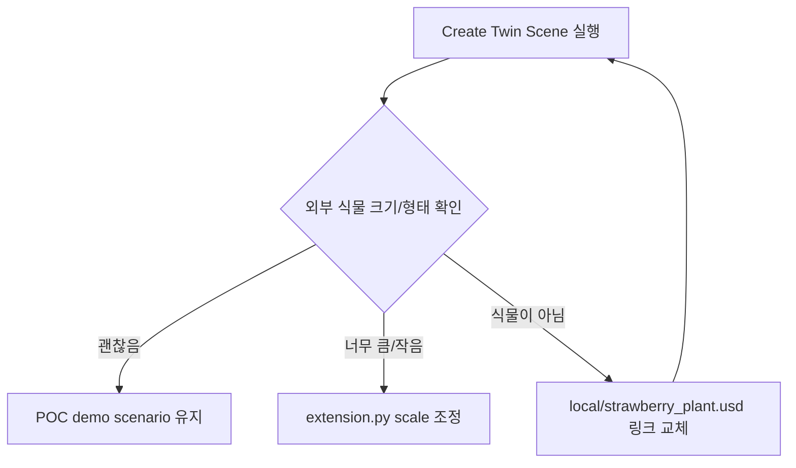

# 공식 Asset Pack 로컬 반입

## 상태

```text
Downloads/
├─ AECDemo_NVD@10012.zip
└─ AECO_TowerDemoPack_NVD@10012.zip

kit-app-template/
└─ source/extensions/joon.smartfarm.twin/assets/
   ├─ README.md
   ├─ official/     git 제외, 원본 asset pack
   └─ local/        git 제외, 현재 POC 선택 자산
```

## 반입 결과

| 위치 | 용도 | 용량 |
|---|---:|---:|
| `assets/official/aec_demo/` | AEC Brownstone 데모, 사이트/식생/조명 후보 | 2.4G |
| `assets/official/tower_demo/` | Tower 데모, 실내 식물/화분/사이트/조명 후보 | 9.7G |
| `assets/local/` | 우리 POC에서 실제 참조할 선택 자산 | 작음 |

## Git 관리

```text
.gitignore
├─ assets/official/  무시
├─ assets/local/     무시
└─ assets/**/*.zip   무시
```

대용량 원본은 커밋하지 않음.

코드/문서만 커밋 대상.

## 현재 연결

```text
assets/local/strawberry_plant.usd
  └─ ../official/tower_demo/Demos/AEC/TowerDemo/TowerDemopack/
     Assets/ArchVis/Residential/Plants/Plant_Succulent_01.usd
```

의미:

```text
Create Twin Scene
  -> extension.py
  -> assets/local/strawberry_plant.usd 탐색
  -> official asset pack 안의 식물 USD 참조
  -> /World/SmartFarm/Plants 아래 배치
```

주의:

| 항목 | 판단 |
|---|---|
| 딸기 전용 모델 | 아님 |
| 외부 asset 참조 테스트 | 가능 |
| 실제 스마트팜 realism | 후보 교체 필요 |
| 온실 전용 모델 | 아직 없음 |

## 바로 확인

```text
1. 앱 실행
2. Smart Farm Twin 창 열림 확인
3. Create Twin Scene 클릭
4. Stage에서 /World/SmartFarm/Plants 확인
5. 기존 primitive 잎 대신 외부 USD 식물 참조 확인
```

## 후보 파일

```text
식물/화분
├─ tower_demo/.../Assets/ArchVis/Residential/Plants/Plant_Succulent_01.usd
├─ tower_demo/.../Assets/ArchVis/Residential/Plants/Plant_Succulent_02.usd
├─ tower_demo/.../Assets/ArchVis/Residential/Plants/Plant_01.usd
├─ tower_demo/.../Assets/ArchVis/Residential/Plants/YuccaCane.usd
├─ tower_demo/.../Assets/ArchVis/Residential/Outdoors/Planters/SquareGardenPlanter_Long.usd
└─ tower_demo/.../Assets/Planter_01/Planter_01.usd

배경/사이트
├─ aec_demo/.../Assets/BrownstoneSite_Lite.usd
├─ aec_demo/.../Assets/BrownstoneSite_Crop.usd
├─ tower_demo/.../Source/context_Site/rh_Site/rh_Site.usd
└─ tower_demo/.../Source/context_Boardwalk_Garden/rh_BW_Garden/rh_BW_Garden.usd

식생/잔디
├─ aec_demo/.../Assets/Vegetation/Shrub/Grass_Short_A.usd
├─ aec_demo/.../Assets/Vegetation/Shrub/Grass_Trimmed_B.usd
├─ tower_demo/.../Source/context_Site/overs/grass.usd
└─ tower_demo/.../Source/context_Boardwalk_Garden/overs/vegetation_BW_Garden.usd
```

## 다음 선택



## 링크 교체 방식

```bash
ln -sfn ../official/<선택한 USD 경로> \
  source/extensions/joon.smartfarm.twin/assets/local/strawberry_plant.usd
```

온실은 같은 방식:

```bash
ln -sfn ../official/<선택한 온실 USD 경로> \
  source/extensions/joon.smartfarm.twin/assets/local/greenhouse.usd
```

현재 pack 안에는 온실 전용 모델 후보가 약함.

온실 realism은 별도 greenhouse/hoop-house/poly-tunnel USD 확보가 더 적합.
