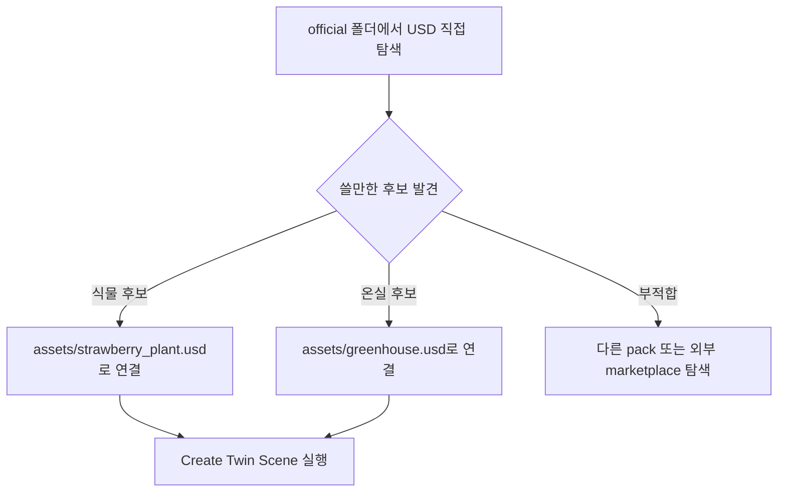

# 공식 Asset Pack 로컬 반입

## 상태

```text
Downloads/
├─ AECDemo_NVD@10012.zip
└─ AECO_TowerDemoPack_NVD@10012.zip

kit-app-template/
└─ source/extensions/joon.smartfarm.twin/assets/
   ├─ README.md
   └─ official/     git 제외, 원본 asset pack
```

## 반입 결과

| 위치 | 용도 | 용량 |
|---|---:|---:|
| `assets/official/aec_demo/` | AEC Brownstone 데모, 사이트/식생/조명 후보 | 2.4G |
| `assets/official/tower_demo/` | Tower 데모, 실내 식물/화분/사이트/조명 후보 | 9.7G |
## Git 관리

```text
.gitignore
├─ assets/official/  무시
├─ assets/greenhouse.usd / strawberry_plant.usd  무시
└─ assets/**/*.zip   무시
```

대용량 원본은 커밋하지 않음.

코드/문서만 커밋 대상.

## 현재 연결

```text
자동 연결 없음
```

의미:

```text
Create Twin Scene
  -> assets/greenhouse.usd 탐색
  -> assets/strawberry_plant.usd 탐색
  -> 없으면 primitive POC 모델 생성
```

주의:

| 항목 | 판단 |
|---|---|
| 딸기 전용 모델 | 아님 |
| 외부 asset 참조 테스트 | 후보 선정 후 가능 |
| 실제 스마트팜 realism | 후보 교체 필요 |
| 온실 전용 모델 | 아직 없음 |

## 바로 확인

```text
1. 앱 실행
2. Smart Farm Twin 창 열림 확인
3. Content Browser 또는 File > Open
4. assets/official/ 아래 USD 직접 확인
5. 후보 경로 기록
```

## 후보 파일

```text
식물/화분
├─ tower_demo/.../Assets/ArchVis/Residential/Plants/Plant_Succulent_01.usd
├─ tower_demo/.../Assets/ArchVis/Residential/Plants/Plant_Succulent_02.usd
├─ tower_demo/.../Assets/ArchVis/Residential/Plants/Plant_01.usd
├─ tower_demo/.../Assets/ArchVis/Residential/Plants/YuccaCane.usd
├─ tower_demo/.../Assets/ArchVis/Residential/Outdoors/Planters/SquareGardenPlanter_Long.usd
└─ tower_demo/.../Assets/Planter_01/Planter_01.usd

배경/사이트
├─ aec_demo/.../Assets/BrownstoneSite_Lite.usd
├─ aec_demo/.../Assets/BrownstoneSite_Crop.usd
├─ tower_demo/.../Source/context_Site/rh_Site/rh_Site.usd
└─ tower_demo/.../Source/context_Boardwalk_Garden/rh_BW_Garden/rh_BW_Garden.usd

식생/잔디
├─ aec_demo/.../Assets/Vegetation/Shrub/Grass_Short_A.usd
├─ aec_demo/.../Assets/Vegetation/Shrub/Grass_Trimmed_B.usd
├─ tower_demo/.../Source/context_Site/overs/grass.usd
└─ tower_demo/.../Source/context_Boardwalk_Garden/overs/vegetation_BW_Garden.usd
```

## 다음 선택



## 후보 확정 후 연결 방식

```bash
ln -sfn official/<선택한 pack 내부 경로>.usd \
  source/extensions/joon.smartfarm.twin/assets/strawberry_plant.usd
```

온실은 같은 방식:

```bash
ln -sfn official/<선택한 pack 내부 경로>.usd \
  source/extensions/joon.smartfarm.twin/assets/greenhouse.usd
```

현재 pack 안에는 온실 전용 모델 후보가 약함.

온실 realism은 별도 greenhouse/hoop-house/poly-tunnel USD 확보가 더 적합.
