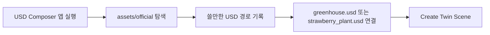

# USD Composer 실행 전환

## 목표

```text
기존 joon.my_editor.kit
  -> 최소 Kit editor
  -> Smart Farm Twin POC 확인 가능
  -> Asset 탐색 불편

신규 joon.smartfarm_composer.kit
  -> USD Composer 기반 앱
  -> Smart Farm Twin extension 같이 로드
  -> Content / Asset / Material / Stage / Layer 계열 UI 활용
```

## 추가 파일

```text
source/apps/joon.smartfarm_composer.kit
usecomposer.sh
```

## 변경 파일

```text
premake5.lua
repo.toml
```

## 실행

```bash
cd /home/joon/kit-app-template
./repo.sh build
./usecomposer.sh
```

직접 실행:

```bash
./repo.sh launch -n joon.smartfarm_composer.kit
```

## 앱 안에서

```text
Smart Farm Twin 창
  -> Create Twin Scene
  -> Run Demo Scenario

Window 메뉴
  -> Content
  -> Asset Browser / Material Browser 계열 확인
```

## Asset Pack 위치

```text
/home/joon/kit-app-template/source/extensions/joon.smartfarm.twin/assets/official
```

## 운용 방식



## 주의

```text
official asset pack은 git 제외
선택한 symlink도 git 제외
코드/문서/앱 설정만 git 관리
```
