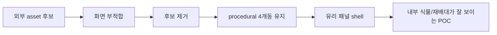

# Sketchfab 후보 원복 + 유리 외피 전환 - 2026-05-23

## 한 줄 상태

```text
Sketchfab greenhouse 후보 2개는 사용 중단
  -> procedural 4개동 POC로 복귀
  -> 외관은 얇은 비닐막 느낌 대신 투명 유리 패널 느낌으로 변경
```

## 왜 원복했나

```text
후보 1: Low poly generic green house
  -> 스마트팜/딸기 비닐하우스 느낌과 맞지 않음

후보 2: Hoop house 20x60
  -> 직접 배치해도 현재 POC 화면과 맞지 않음

판단
  -> 외부 asset 후보를 억지로 쓰기보다
  -> 현재 procedural POC를 유지하면서 형태/재질을 먼저 안정화
```

## git 기준점

```text
5d769ae
  Preserve visual greenhouse POC checkpoint

ea25e4e
  Revert "Record greenhouse candidate conversion state"

b993bdd
  Revert "Prepare greenhouse asset candidate comparison"
```

의미:

```text
Sketchfab 후보 선택 UI / candidates 문서 / 후보 README 제거
로컬에 남아 있던 candidates 폴더 삭제
4개동 procedural POC 상태로 복귀
```

## 유리 외피 방향

```text
기존
  비닐 시트 + 비닐 라인

변경
  얇은 반투명 유리 패널 + 진한 유리 프레임/멀리언
```



## 코드 기준 변경

```text
_create_vinyl_cover_panels
  -> _create_glass_cover_panels

_create_vinyl_film_strips
  -> _create_glass_panel_edges
```

현재 표현:

```text
유리 패널
├─ 측면: opacity 0.10
├─ 전후면: opacity 0.08
├─ 벽-지붕 사이 arch closure: opacity 0.001
├─ 지붕: opacity 0.001
└─ ridge cap / infill: opacity 0.001

유리 프레임/멀리언
├─ 측면: opacity 0.82
├─ 지붕 edge: opacity 0.78
├─ 지붕 mullion: opacity 0.82
└─ 끝단 frame: opacity 0.82~0.88
```

추가 보정:

```text
GlassRidgeCap
  -> 지붕 중앙 상단 빈 부분을 덮는 긴 투명 패널

GlassRidgeInfillLeft / Right
  -> ridge 양옆 경사면 빈 부분을 보완

LeftEaveArchGlass_* / RightEaveArchGlass_*
  -> 측벽 상단과 지붕 처마 사이의 빈 공간을 3단 경사 패널로 보완
  -> 직사각형 벽처럼 튀어나오지 않고 지붕 경사에 붙는 느낌

FrontUpperClosureGlass / BackUpperClosureGlass
  -> 전후면 벽 상단 빈 공간 보완
```

## 내부 밝기 보정

어두워 보이는 원인:

```text
RTX Real-Time에서 투명 지붕만으로는 내부가 충분히 밝아지지 않음
바닥/통로 색이 어두우면 빛을 받아도 화면이 무겁게 보임
```

적용한 보정:

```text
DomeLight SoftSky
  intensity 250 -> 650

Sun
  intensity 1800 -> 3200
  angle 0.8 -> 1.2

InteriorFill SphereLight
  4개동 각각 3개씩 배치
  내부 y=5.4 위치에서 부드러운 보조광
  radius 0.12
  -> 큰 흰 구체가 보이지 않도록 최소 크기 유지

LEDStripLight RectLight
  각 LED Strip 아래에 실제 area light 배치
  기본 intensity 420
  Run Demo Scenario 후 intensity 1350
  -> LED가 단순 노란 막대가 아니라 작물/통로를 실제로 비춤

바닥/통로 색
  Ground / CentralWalkway / SoilPatch를 조금 밝게 조정
```

## 동적 Demo 방향 수정

기존 문제:

```text
Create Twin Scene 직후부터 딸기가 이미 많이 달려 있음
Run Demo Scenario를 눌러도 시각 변화가 작음
Gemma 4.0이 최적 제어안을 제시했다는 흐름이 약함
```

수정한 구조:

```text
Create Twin Scene
  -> Baseline risk state
  -> LED 낮음 / 배지 수분 부족 / 팬 정지 / 딸기 착과 적음

Run Demo Scenario
  -> Gemma 4.0 blueprint 적용
  -> LED 밝기 증가
  -> 관수 라인 활성화
  -> 팬 airflow 표시
  -> 딸기 열매 생성/강조
  -> 예상 출하일 회복
```

데모 제어 요소:

```text
Light
  LED 40% / 12h -> LED 85% / 16h

Irrigation
  Moisture 31% -> 48%
  WaterValve + IrrigationFlow 강조

Fan
  Fan 0% -> 70%
  각 비닐하우스 천장 중앙에 순환팬 3개
  CeilingFan + Airflow line 강조
```

## 바닥/팬 구성 정리

제거:

```text
AisleSoilPatch
FallenStrawberries
```

이유:

```text
실제 딸기 고설재배 이미지와 맞지 않음
POC에서 제어 시나리오 설명에 도움되지 않음
```

변경:

```text
기존 벽면 VentFan 2개
  -> 천장 CeilingFan 3개

각 동마다:
  CeilingFan_1
  CeilingFan_2
  CeilingFan_3

사진처럼 비닐하우스 천장 중앙 라인에 매달린 순환팬 구조
```

## 확인 방법

```bash
cd /home/joon/kit-app-template
./usecomposer.sh
```

앱에서:

```text
Smart Farm Twin
  -> Create Twin Scene
```

확인 포인트:

```text
1. Sketchfab 후보 버튼이 없어야 함
2. 4개동 2x2 구조가 보여야 함
3. 외관은 연한 청록색 투명 유리 패널처럼 보여야 함
4. 내부 재배대/식물이 유리벽 뒤로 보여야 함
5. 프레임/멀리언은 외곽선을 확실히 잡아줘야 함
```

## 다음 판단

```text
유리벽은 POC 시각화에는 가능
  장점: 내부가 잘 보임, 외곽이 안정적으로 보임
  단점: 실제 한국형 비닐하우스 재질과는 다름

현실성 방향
  1차 POC: 유리처럼 잘 보이게 구성
  이후 고도화: 실제 비닐막 shader / 주름 / 반사 / 곡면 asset으로 교체
```
