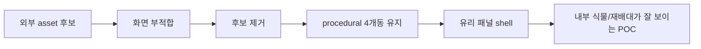

# Sketchfab 후보 원복 + 유리 외피 전환 - 2026-05-23

## 한 줄 상태

```text
Sketchfab greenhouse 후보 2개는 사용 중단
  -> procedural 4개동 POC로 복귀
  -> 외관은 얇은 비닐막 느낌 대신 투명 유리 패널 느낌으로 변경
```

## 왜 원복했나

```text
후보 1: Low poly generic green house
  -> 스마트팜/딸기 비닐하우스 느낌과 맞지 않음

후보 2: Hoop house 20x60
  -> 직접 배치해도 현재 POC 화면과 맞지 않음

판단
  -> 외부 asset 후보를 억지로 쓰기보다
  -> 현재 procedural POC를 유지하면서 형태/재질을 먼저 안정화
```

## git 기준점

```text
5d769ae
  Preserve visual greenhouse POC checkpoint

ea25e4e
  Revert "Record greenhouse candidate conversion state"

b993bdd
  Revert "Prepare greenhouse asset candidate comparison"
```

의미:

```text
Sketchfab 후보 선택 UI / candidates 문서 / 후보 README 제거
로컬에 남아 있던 candidates 폴더 삭제
4개동 procedural POC 상태로 복귀
```

## 유리 외피 방향

```text
기존
  비닐 시트 + 비닐 라인

변경
  얇은 반투명 유리 패널 + 진한 유리 프레임/멀리언
```



## 코드 기준 변경

```text
_create_vinyl_cover_panels
  -> _create_glass_cover_panels

_create_vinyl_film_strips
  -> _create_glass_panel_edges
```

현재 표현:

```text
유리 패널
├─ 측면: opacity 0.18
├─ 전후면: opacity 0.16
└─ 지붕: opacity 0.17

유리 프레임/멀리언
├─ 측면: opacity 0.82
├─ 지붕 edge: opacity 0.78
├─ 지붕 mullion: opacity 0.82
└─ 끝단 frame: opacity 0.82~0.88
```

## 확인 방법

```bash
cd /home/joon/kit-app-template
./usecomposer.sh
```

앱에서:

```text
Smart Farm Twin
  -> Create Twin Scene
```

확인 포인트:

```text
1. Sketchfab 후보 버튼이 없어야 함
2. 4개동 2x2 구조가 보여야 함
3. 외관은 연한 청록색 투명 유리 패널처럼 보여야 함
4. 내부 재배대/식물이 유리벽 뒤로 보여야 함
5. 프레임/멀리언은 외곽선을 확실히 잡아줘야 함
```

## 다음 판단

```text
유리벽은 POC 시각화에는 가능
  장점: 내부가 잘 보임, 외곽이 안정적으로 보임
  단점: 실제 한국형 비닐하우스 재질과는 다름

현실성 방향
  1차 POC: 유리처럼 잘 보이게 구성
  이후 고도화: 실제 비닐막 shader / 주름 / 반사 / 곡면 asset으로 교체
```
