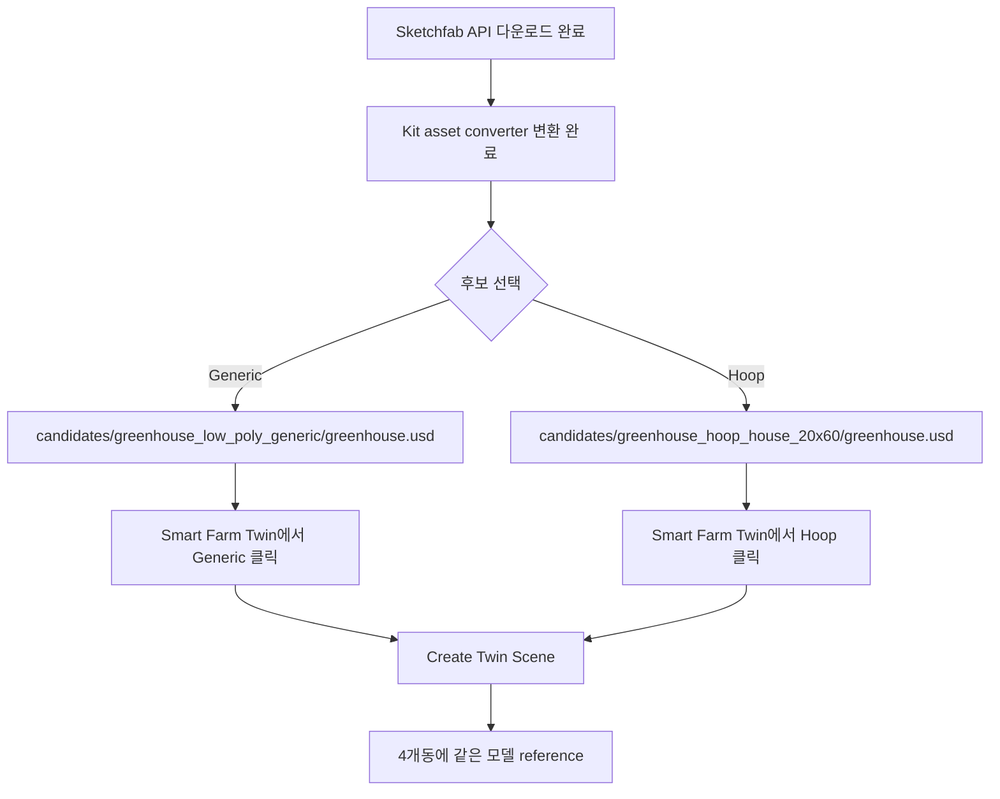

# Sketchfab 비닐하우스 후보 포팅 준비 - 2026-05-23

## 한 줄 상태

```text
두 Sketchfab 후보를 바로 비교할 수 있도록
다운로드 + USD 변환 + Smart Farm Twin UI 연결까지 완료
```

## 먼저 보존한 기준점

```text
commit 5d769ae
Preserve visual greenhouse POC checkpoint
```

의미:

```text
현재 procedural 비닐하우스 + 4개동 2x2 POC 상태로 언제든지 복귀 가능
```

## 후보 1

```text
Low poly generic green house
https://sketchfab.com/3d-models/low-poly-generic-green-house-76a4c0e3c0554d29925fbf9fb47f0ca5

Author: assetfactory
License shown: Free Standard
Triangles: 11.6k
Vertices: 6.4k
특징: 내부 환경 포함, game-ready asset
```

배치 위치:

```text
source/extensions/joon.smartfarm.twin/assets/candidates/greenhouse_low_poly_generic/greenhouse.usd
```

## 후보 2

```text
Green House - Hoop_house_20x60
https://sketchfab.com/3d-models/green-house-hoop-house-20x60-f0cbdcb75b2b4dad9c334e934503dee3

Author: videogreg
License shown: CC Attribution
Triangles: 1.3k
Vertices: 1.2k
특징: hoop house / poly covered 형태, 매우 가벼움
```

배치 위치:

```text
source/extensions/joon.smartfarm.twin/assets/candidates/greenhouse_hoop_house_20x60/greenhouse.usd
```

## 다운로드 상태

```text
Sketchfab API direct download
  -> 인증 토큰 등록 후 성공
  -> glTF archive 다운로드
  -> raw/extracted/ 아래 압축 해제
  -> Kit asset converter로 greenhouse.usd 변환 완료
```

완료한 것:

```text
assets/candidates/ 폴더 구조 생성
후보별 README 작성
Smart Farm Twin UI 후보 선택 버튼 추가
.gitignore에 후보 모델/텍스처/raw/manifest 제외 추가
greenhouse_low_poly_generic/greenhouse.usd 생성
greenhouse_hoop_house_20x60/greenhouse.usd 생성
```

생성된 로컬 파일:

```text
source/extensions/joon.smartfarm.twin/assets/candidates/greenhouse_low_poly_generic/greenhouse.usd
  size: 약 860 KB

source/extensions/joon.smartfarm.twin/assets/candidates/greenhouse_hoop_house_20x60/greenhouse.usd
  size: 약 112 KB
```

## UI 사용

```text
Smart Farm Twin
├─ Auto Asset
├─ Generic
└─ Hoop
```



## 다음 실제 작업

```text
1. USD Composer 실행
2. Smart Farm Twin 창에서 Generic 클릭
3. Create Twin Scene 클릭
4. 4개동에 후보 1이 들어가는지 눈으로 확인
5. Hoop 클릭
6. Create Twin Scene 다시 클릭
7. 4개동에 후보 2가 들어가는지 눈으로 확인
8. 더 나은 후보를 선택한 뒤 scale / rotation / position 보정
9. 최종 후보를 assets/greenhouse.usd로 승격
```

실행 명령:

```text
./usecomposer.sh
```

눈으로 확인할 UI 흐름:

```text
Smart Farm Twin
  Generic -> Create Twin Scene
  Hoop    -> Create Twin Scene
```

## 판단 메모

```text
POC 비교는 후보 2가 더 유력
  이유: hoop house / poly covered / low triangle

후보 1은 비교용
  이유: 내부 환경이 있어 화면은 풍부하지만 한국형 비닐하우스와 다를 가능성

현재 주의점
  변환은 성공했지만 실제 배치 scale / 회전 / 높이는 Composer 화면에서 보고 보정해야 함
  Sketchfab 후보는 외부 라이선스가 있으므로 원본/변환 파일은 git에 넣지 않음
```
