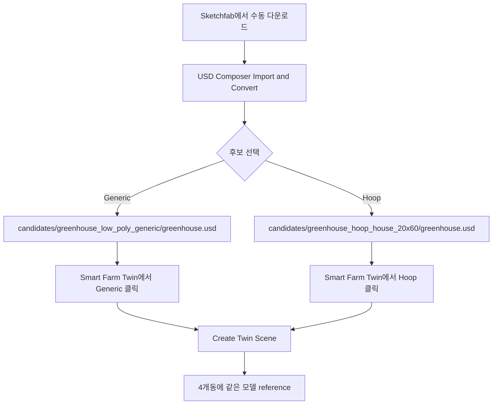

# Sketchfab 비닐하우스 후보 포팅 준비 - 2026-05-23

## 한 줄 상태

```text
두 Sketchfab 후보를 바로 비교할 수 있도록
Smart Farm Twin UI와 assets/candidates 구조를 추가
```

## 먼저 보존한 기준점

```text
commit 5d769ae
Preserve visual greenhouse POC checkpoint
```

의미:

```text
현재 procedural 비닐하우스 + 4개동 2x2 POC 상태로 언제든지 복귀 가능
```

## 후보 1

```text
Low poly generic green house
https://sketchfab.com/3d-models/low-poly-generic-green-house-76a4c0e3c0554d29925fbf9fb47f0ca5

Author: assetfactory
License shown: Free Standard
Triangles: 11.6k
Vertices: 6.4k
특징: 내부 환경 포함, game-ready asset
```

배치 위치:

```text
source/extensions/joon.smartfarm.twin/assets/candidates/greenhouse_low_poly_generic/greenhouse.usd
```

## 후보 2

```text
Green House - Hoop_house_20x60
https://sketchfab.com/3d-models/green-house-hoop-house-20x60-f0cbdcb75b2b4dad9c334e934503dee3

Author: videogreg
License shown: CC Attribution
Triangles: 1.3k
Vertices: 1.2k
특징: hoop house / poly covered 형태, 매우 가벼움
```

배치 위치:

```text
source/extensions/joon.smartfarm.twin/assets/candidates/greenhouse_hoop_house_20x60/greenhouse.usd
```

## 다운로드 상태

```text
Sketchfab API direct download
  -> 401 Unauthorized
  -> 로그인/토큰 필요
```

그래서 모델 파일은 자동 다운로드하지 못함.

대신 완료한 것:

```text
assets/candidates/ 폴더 구조 생성
후보별 README 작성
Smart Farm Twin UI 후보 선택 버튼 추가
.gitignore에 후보 모델 파일 제외 추가
```

## UI 사용

```text
Smart Farm Twin
├─ Auto Asset
├─ Generic
└─ Hoop
```



## 다음 실제 작업

```text
1. Sketchfab 로그인
2. 두 모델 다운로드
3. USD Composer에서 Import and Convert
4. 변환 결과를 후보 폴더의 greenhouse.usd로 저장/복사
5. Generic / Hoop 버튼으로 각각 Create Twin Scene 확인
6. 더 나은 후보를 assets/greenhouse.usd로 승격
```

## 판단 메모

```text
POC 비교는 후보 2가 더 유력
  이유: hoop house / poly covered / low triangle

후보 1은 비교용
  이유: 내부 환경이 있어 화면은 풍부하지만 한국형 비닐하우스와 다를 가능성
```
