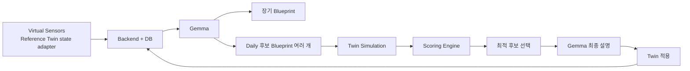
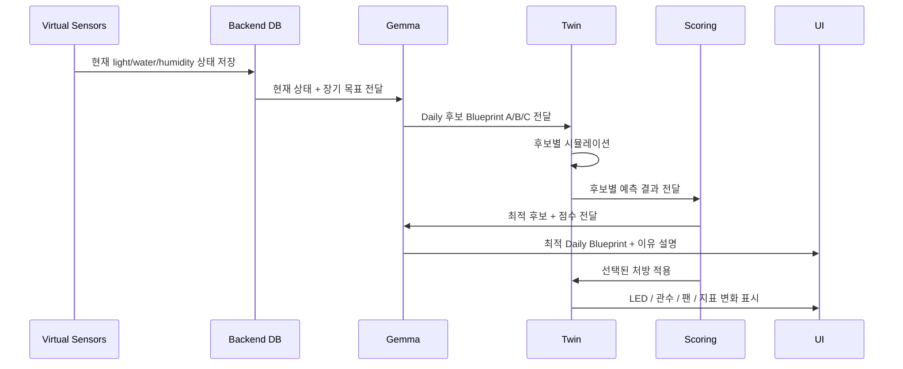
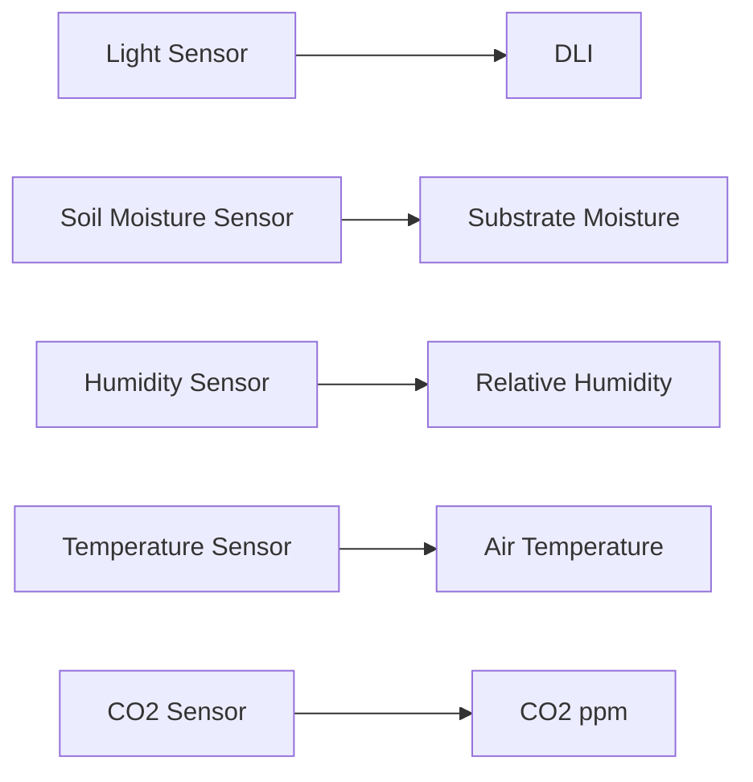
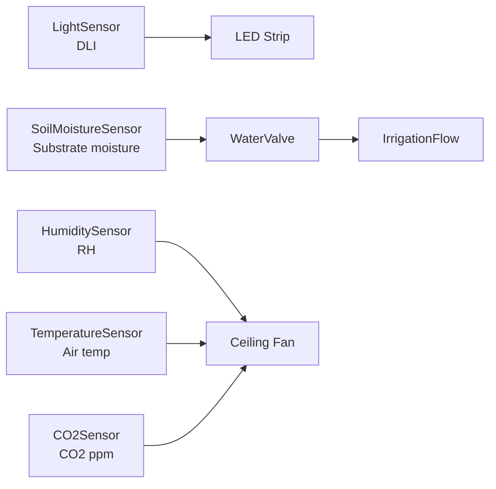

# Gemma Blueprint + Twin 시나리오 구조 정리 - 2026-05-24

## 한 줄 결정

```text
외관 V1은 고정
  -> 이제 핵심은 "Gemma가 후보 처방을 만들고, Twin + Scoring이 검증/선택하고, Gemma가 설명"하는 흐름
```

## 최종 서비스 구조



주의:

```text
K8S DB는 정확한 표현이 아님
  -> Kubernetes는 DB가 아니라 배포 환경
  -> 정확히는 "K8S 안에 배포된 Backend + DB"

POC에서는 K8S DB부터 만들지 않음
  -> local JSON / in-memory mock
  -> 이후 PostgreSQL 또는 API adapter
  -> 마지막에 K8S 배포
```

의미:

```text
Gemma
  -> 후보 처방 생성
  -> 장기 목표와 현재 상태를 읽고 Daily 후보를 여러 개 만듦
  -> Scoring 결과를 사람이 이해할 수 있게 설명

Twin
  -> 후보 처방을 가상 환경에서 실행
  -> 출하일 / 품질 / 리스크 / 운영비 예측

Scoring Engine
  -> 후보별 점수 계산
  -> 최적 후보 선택
  -> LLM 판단이 아니라 deterministic rule 기반

Backend + DB
  -> 센서 상태
  -> Gemma Blueprint
  -> Twin 시뮬레이션 결과
  -> 선택된 Daily Blueprint 저장
```

역할 분리:

```text
Gemma가 농장을 직접 제어한다
  -> 비약 있음
  -> 재현성/안전성 약함

Gemma가 후보 처방을 만들고 설명한다
Twin + Scoring이 검증하고 선택한다
  -> 논리적으로 안정적
  -> POC 구현 가능
```

## Blueprint 2개 구조

### 1. 장기 Blueprint

```text
목표
  조기 출하

예시
  기존 예상 출하일: 2026-12-28
  목표 출하일: 2026-12-22

관리 방향
  광량 부족 보정
  수분 스트레스 제거
  과습 / 병해 위험 낮추기
  운영비 증가폭 관리
```

장기 Blueprint의 역할:

```text
처방 1개가 아니라 전체 운영 전략
Daily Blueprint가 매일 따라야 할 큰 방향
완전 고정 계획이 아니라 매일 결과를 반영해 갱신되는 moving plan
```

### 2. Daily Blueprint

```text
매일 현재 센서값 기반
여러 후보 처방 생성
Twin에서 후보별 결과 비교
Scoring Engine이 전체 조기 출하 목표에 가장 좋은 후보 선택
Gemma가 선택 이유를 사용자에게 설명
```

예시:

```text
후보 A
  LED 보광 강함
  관수 보통
  팬 약함

후보 B
  LED 보광 중간
  관수 강화
  팬 중간

후보 C
  LED 보광 중간
  관수 보통
  팬 강함

Twin 예측
  Predicted size
  Predicted yield
  v0 score
  Future: disease risk / OpEx / quality

Scoring Engine 선택
  오늘은 후보 B 추천
  이유: 목표 수확일 기준 예상 크기와 예상 수확량 점수가 가장 좋음

Gemma 설명
  후보 B가 장기 조기 출하 목표에 가장 적합한 이유를 자연어로 설명
```

## 최소 센서/제어 범위

POC에서는 3개 축만 사용:

```text
Light
Water
Fan
```

이유:

```text
화면에서 잘 보임
딸기 온실 운영 설명에 충분함
조기 출하 목표와 연결하기 쉬움
온도 / CO2 / EC / pH까지 넣으면 POC 범위가 커짐
```

## Virtual Sensor 데이터

실제 온실/센서는 없으므로 Reference Twin 내부 상태를 센서 입력 형태로 변환한다.
지금은 Twin 내부에서 deterministic virtual sensor state를 생성한다.

중요:

```text
가상 센서는 랜덤 값 생성기가 아님
  -> POC에서 보여줄 하루 상태를 재현 가능한 baseline으로 고정
  -> 제어 처방을 적용하면 규칙 기반으로 값이 변함
  -> 같은 입력이면 같은 결과가 나와야 함
```

생성 방식:

```text
1. 기준 상태를 정함
   흐린 겨울날 / 조기 출하 목표 대비 광량 부족 / 수분 부족 / 습도 높음

2. 센서값 범위를 현실적인 값으로 제한
   DLI: 딸기 온실 부족 상태 10-12 mol/m2/day 근처
   배지 수분: 부족 상태 31%
   습도: 과습 위험 82%

3. 제어 명령을 적용하면 deterministic rule로 상태 변화
   LED 80% / 16h -> 광량 부족 완화
   관수 3회 / 목표 48% -> 수분 스트레스 완화
   팬 55% -> 습도 / 병해 위험 완화

4. 이후 실제 센서가 생기면 이 mock state만 API / DB adapter로 교체
```

주의:

```text
Fan 자체는 센서가 아니라 actuator
센서값은 humidity / airflow / disease risk
제어 명령이 fan_duty_percent
```

```text
Light
  dli_mol_m2_day
  outside_light_condition
  accumulated_light_status

Water
  substrate_moisture_percent
  water_stress_level

Fan
  humidity_percent
  airflow_status
  disease_risk_level
```

제어 명령:

```text
Light actuator
  led_intensity_percent
  photoperiod_hours

Water actuator
  irrigation_pulses_per_day
  target_moisture_percent

Fan actuator
  fan_duty_percent
```

최소 DB row 느낌:

```json
{
  "facility_id": "smartfarm-v1",
  "crop": "strawberry",
  "day": 18,
  "light": {
    "dli_mol_m2_day": 11.2,
    "outside_light_condition": "cloudy",
    "accumulated_light_status": "low"
  },
  "water": {
    "substrate_moisture_percent": 31,
    "water_stress_level": "high"
  },
  "fan": {
    "humidity_percent": 82,
    "airflow_status": "stagnant",
    "disease_risk_level": "high"
  }
}
```

## Daily Blueprint 출력 예시

```json
{
  "goal": "early_shipment",
  "target_shipment_date": "2026-12-22",
  "selected_scenario": "B",
  "today_plan": {
    "light": {
      "photoperiod_hours": 16,
      "led_intensity_percent": 80,
      "reason": "accumulated light is below the early-shipment target"
    },
    "water": {
      "target_moisture_percent": 48,
      "irrigation_pulses_per_day": 3,
      "reason": "substrate moisture is below the optimal range"
    },
    "fan": {
      "fan_duty_percent": 55,
      "reason": "humidity and disease risk need reduction"
    }
  },
  "expected_impact": {
    "predicted_size_mm": 36,
    "predicted_yield_kg": 3.3,
    "target_size_mm": 35,
    "target_yield_kg": 3.2,
    "v0_score": 100.0
  }
}
```

## 후보 평가 기준

```text
v0에서 좋은 후보
  목표 수확일 forecast horizon에서 예상 크기가 큼
  예상 수확량이 높음
  두 지표를 정규화한 v0 score가 가장 높음

향후 확장할 평가 항목
  품질 점수
  병해 위험 penalty
  운영비/OPEX penalty
  출하일 단축 효과
```

현재 POC v0 scoring 결정:

```text
score = 100 * (0.5 * size_score + 0.5 * yield_score)

size_score  = min(predicted_size_mm / target_size_mm, 1.0)
yield_score = min(predicted_yield_kg / target_yield_kg, 1.0)
```

의미:

```text
지금 단계에서는 예상 크기와 예상 수확량만 사용한다.
risk / OPEX / 품질은 아직 실제 모델 근거가 약하므로 v0 score에는 넣지 않는다.
향후 Twin dynamics와 센서/전문가 규칙이 보강되면 penalty 항목으로 확장한다.
```

예시:

| 후보 | predicted size | predicted yield | size_score | yield_score | v0 score | 결과 |
|---|---:|---:|---:|---:|---:|---|
| A 안전형 | 32 mm | 2.8 kg | 0.91 | 0.87 | 89.5 | 후보 |
| B 균형형 | 36 mm | 3.3 kg | 1.00 | 1.00 | 100.0 | BEST |
| C 공격형 | 34 mm | 3.1 kg | 0.97 | 0.97 | 97.0 | 후보 |

정확한 농업 모델이 아니라 POC용 의사결정 모델.
나중에 실제 생육 모델 / 센서 데이터 / 전문가 규칙으로 교체 가능.

선택 책임:

```text
Gemma
  후보 생성
  결과 설명

Twin
  후보별 결과 예측

Scoring Engine
  최종 후보 선택
```

## 보광 LED 근거 정리

중요한 표현:

```text
딸기 비닐하우스의 기본 광원은 태양광
LED는 완전 인공광이 아니라 부족한 일조량을 보정하는 보광 장치
겨울철 / 흐린 날 / 조기 출하 / 품질 안정화 목적에서 사용 가능
```

POC에서의 의미:

```text
LED로 딸기를 키운다
  -> 부정확

태양광 기반 비닐하우스에서 부족한 일조량을 LED 보광으로 보정한다
  -> 적절
```

참고 근거:

```text
Ohio State Controlled Environment Berry
  딸기 보광은 과거 비용 때문에 제한적이었지만 LED 발전으로 활용 가능성이 커짐
  https://u.osu.edu/indoorberry/photosynthetic-lighting/

JIRCAS strawberry greenhouse LED result
  딸기 온실에서 환경제어와 LED 보광 조합을 생산성 향상 목적으로 다룸
  https://www.jircas.go.jp/en/publication/research_results/2023_c01

ISHS greenhouse strawberry supplemental lighting
  온실 딸기 보광 연구 사례
  https://ishs.org/ishs-article/1170_130/
```

## Run Demo Scenario가 보여줘야 할 흐름



화면 변화:

```text
Before
  DLI 부족
  배지 수분 31%
  습도 82%
  팬 0%
  예상 출하일 2026-12-28

After
  LED 보광 16h / 80%
  배지 수분 목표 48%
  팬 55%
  병해 위험 controlled
  예상 출하일 2026-12-22
  Yield Score 87
  OpEx +18%
```

## 다음 구현 기준

```text
1. UI를 3구역으로 변경
   Current Sensor State
   Gemma Daily Blueprint
   Twin Predicted Impact

2. Run Demo Scenario 동작 변경
   센서 baseline 생성
   후보 Blueprint 3개 생성
   Twin simulation
   Scoring Engine으로 최적 후보 선택
   최적 후보 선택
   씬에 Light / Water / Fan 적용

3. DB는 처음부터 실제 K8S 연결하지 않음
   우선 local in-memory / JSON mock
   이후 Backend DB adapter로 교체
   마지막 단계에서 K8S에 배포
```

## 구현 현실성 판단

```text
1단계: Omniverse 내부 mock 데이터
  현실성 높음
  바로 구현 가능

2단계: 후보 시나리오 3개 + scoring
  현실성 높음
  rule-based로 구현 가능

3단계: Gemma 응답 JSON 흉내
  현실성 높음
  처음에는 hardcoded JSON으로 시작

4단계: 실제 Gemma API 연결
  현실성 중간
  API key / prompt / JSON schema 필요

5단계: Backend DB 연결
  현실성 중간
  POC 후반에 적용

6단계: K8S 배포
  현실성 중간
  데모 핵심 검증 후 진행
```

최소 구현 목표:

```text
Run Demo Scenario 클릭
  1. 현재 가상 센서 상태 표시
  2. Gemma 후보 Blueprint A/B/C 표시
  3. Twin이 후보별 예측값 생성
  4. Scoring Engine이 최적 후보 B 선택
  5. Gemma가 선택 이유 설명
  6. LED / 관수 / 팬 작동
  7. 출하일 2026-12-28 -> 2026-12-22 표시
```

## 2026-05-24 생육 시뮬레이션 구현 메모

```text
Scene 생성 버튼을 2개로 분리

Create Mature Scene
  -> 현재 V1 외관 확인용
  -> 식물 / runner / 딸기가 모두 다 자란 상태
  -> Timeline animation 없음

Create Growth Simulation
  -> 발표용 생육 변화 확인용
  -> Timeline 0-60일
  -> Play를 누르면 생육 단계가 보임
```

생육 압축 흐름:

```text
Day 0
  식물 작음
  runner invisible
  strawberry invisible

Day 20
  식물 커짐
  runner 생성 시작

Day 38
  작은 딸기 생성

Day 60
  식물 V1 최종 크기 도달
  runner 최종 길이
  strawberry 최종 크기
```

구현 방식:

```text
실제 물리 생육 모델 아님
  -> USD time-sampled transform / visibility 기반 POC animation

식물
  -> Daphne asset scale 0.011 -> 0.020

runner
  -> 처음 invisible
  -> Day 20부터 visible
  -> Y scale 0.05 -> 1.0

딸기
  -> 처음 invisible
  -> Day 38부터 visible
  -> strawberry.glb scale 8% -> 45% -> 100%
```

60일로 바꾼 이유:

```text
30일
  -> 개화 / 착과 이후 딸기가 익는 구간에는 적합
  -> 이미 꽃이나 작은 열매가 있는 상태라면 설명 가능

60일
  -> 작은 식물에서 생육 증가 + runner/fruiting stem 생성 + 딸기 비대까지 보여주기 위한 압축 구간
  -> 실제 전체 재배 기간을 정확히 재현하는 값은 아니지만 POC 시각화로 더 자연스러움

주의
  -> 실제 runner는 보통 번식 줄기이고, 과실은 꽃대 / 과방에서 맺힘
  -> 현재 POC의 HangingRunner는 발표 화면에서 과실이 매달리는 줄기처럼 보이게 만든 visual placeholder
  -> 추후 명칭은 FruitTruss / HangingTruss로 바꾸는 것이 더 정확함
```

## 2026-05-24 Reference Twin + Rolling Horizon 보정

### 실제 환경 vs 현재 POC 환경 구분

이 프로젝트에서 반드시 구분해야 할 점은 다음이다.

```text
실제 상용/현장 서비스
  -> 실제 스마트팜이 존재
  -> 실제 센서가 매일 측정값을 생성
  -> Daily Blueprint는 실제 센서값을 입력으로 받아 오늘의 보정 처방을 제시
  -> 처방 결과는 실제 actuator/농장 운영으로 반영되고 다음 날 다시 측정됨

현재 POC / SJP 작업 환경
  -> 실제 스마트팜 환경 없음
  -> 실제 센서 데이터 없음
  -> Omniverse Reference Twin을 스마트팜 환경으로 가정
  -> 매일 읽는 현재 센서값도 Reference Twin 내부 상태에서 deterministic virtual sensor로 생성
  -> Daily Blueprint loop의 논리를 검증하기 위한 synthetic closed-loop testbed
```

따라서 현재 POC에서 "매일 현재 센서값을 읽는다"는 표현은 실제 농장에서 들어오는 센서값을 의미하지 않는다.

```text
현재 POC의 current sensor state
  = Reference Twin의 day/state/scenario seed/control history로부터 생성한 virtual sensor state
  = 실제 측정값이 아니라, 서비스 입력 interface를 흉내내는 deterministic synthetic input
```

발표/문서 표현에서는 다음처럼 상태를 명확히 표시한다.

```text
Actual deployment assumption
  Real farm sensors -> Backend DB -> Daily Blueprint -> actuator operation -> next-day measured state

Current prototype implementation
  Reference Twin state -> Virtual Sensor adapter -> Daily Blueprint mock/scoring -> Twin visual update -> next-day synthetic state
```

이 구분을 통해 현재 결과를 실제 농장 실증으로 과장하지 않고, 대신 "실제 센서/DB adapter로 교체 가능한 서비스 논리 POC"로 설명한다.

### 고민 이슈와 최종 논리

이번 구조를 잡으면서 생긴 핵심 고민은 다음이다.

```text
처음 한 번만 60일 시뮬레이션해서 최적 플랜을 정하면,
이후 매일 바뀌는 현재 센서 상태를 고려하지 못한다.

그 결과 Day 0에는 좋아 보였던 계획이
Day t의 실제/현재 상태에서는 별로인 플랜이 될 수 있다.
```

스마트팜 운영은 단발성 계획 문제가 아니라 매일 변하는 상태를 반영하는 보정 문제다.
실제 스마트팜에는 다양한 센서가 있고, 값은 매일 달라진다. 본 POC에서는 범위를 줄여 다음 세 축만 고려한다.

```text
Light
  -> DLI / LED intensity / photoperiod

Water
  -> substrate moisture / irrigation

Fan / Airflow
  -> humidity / airflow / disease-risk proxy
```

따라서 서비스 논리는 다음처럼 정리한다.

```text
장기 목표
  -> 2026-12-22 조기출하

매일 입력
  -> 현재 sensor state 또는 Reference Twin의 virtual sensor state

매일 판단
  -> 오늘 LED / 관수 / 팬을 어떻게 보정할지 결정

장기 영향 검증
  -> 오늘의 후보 처방이 출하일 / 수확점수 / 병해위험 / 운영비에 미치는 영향을
     60일 forecast horizon으로 빠르게 예측

서비스 출력
  -> 고정된 60일 계획이 아니라 Today's corrective Daily Blueprint
```

즉, 이 서비스는 60일 전체 운영 계획을 한 번에 확정하는 서비스가 아니다.

```text
Bad framing
  -> Day 0에서 60일짜리 최적 운영계획을 한 번 만들고 그대로 실행

Correct framing
  -> 매일 현재 상태를 읽고 오늘의 세부 보정 Blueprint를 생성
  -> 단, 오늘의 처방 선택 근거로 60일 horizon forecast를 사용
  -> 다음 날에는 업데이트된 상태로 다시 재계획
```

이 구조는 receding-horizon / rolling-horizon decision support로 설명한다.

```text
매일 측정한다.
매일 추천한다.
하지만 오늘의 추천을 고를 때는 60일 뒤 효과까지 본다.
```

발표용 핵심 문장:

```text
본 서비스는 고정된 60일 운영계획을 한 번에 생성하는 것이 아니라,
매일 현재 센서 상태를 반영해 오늘의 세부 보정 Blueprint를 제시한다.
60일 Twin 시뮬레이션은 오늘 처방의 장기 영향을 평가하기 위한 forecast horizon이다.
```

영문 slide 문장:

```text
The service does not generate a fixed 60-day operation plan.
Instead, it generates a daily corrective Blueprint based on the current sensor state.
The 60-day Twin simulation is used as a forecast horizon to evaluate the long-term impact of today's action.
```

이 논리에서 Virtual Sensor는 단순 장식이 아니다. Virtual Sensor가 있어야 서비스가 "한 번 만든 계획"이 아니라 "현재 상태 기반 daily correction"으로 설명된다.

```text
Virtual Sensor의 역할
  -> 오늘의 상태를 정의
  -> 후보 Blueprint들이 같은 현재 상태에서 비교되도록 기준 제공
  -> Day t+1 상태가 바뀌면 Blueprint도 바뀌는 구조 제공
  -> 후속 단계에서 실제 센서/DB adapter로 교체 가능한 interface 역할
```

따라서 현재 POC에서 가상 센서는 다음처럼 설명한다.

```text
실제 농장 센서값은 아직 없음.
대신 Reference Twin의 현재 상태를 deterministic virtual sensor state로 표현.
이 값은 random이 아니라 scenario seed와 control action에 의해 재현 가능하게 계산됨.
```

현재 프로젝트는 실제 온실과 연결된 live digital twin이 아니다. 따라서 발표와 구현 문서에서는 다음처럼 정리한다.

```text
Live Farm Twin이 아니라 Reference Twin이다.

실제 온실 센서/actuator가 연결된 서비스가 아니라,
딸기 스마트팜 운영 조건을 가정한 Omniverse 기반 Reference Twin 환경에서
AI 운영 처방 후보를 비교·검증하는 의사결정 지원 POC다.
```

서비스 의미는 60일 animation 자체가 아니라 daily decision support에 있다.

```text
서비스 출력
  -> Today's Daily Blueprint
  -> 오늘 LED / 관수 / 팬을 어떻게 운영할지에 대한 처방
  -> 선택 이유와 예상 영향 제공

60일 시뮬레이션
  -> 서비스 출력 자체가 아님
  -> 오늘의 Blueprint 후보를 고르기 위한 forecast horizon
  -> 후보별 출하일 / 수확점수 / 병해위험 / 운영비 영향을 빠르게 비교하는 근거
```

따라서 핵심 문장은 다음과 같다.

```text
The 60-day simulation is not the service output itself.
It is a forecast horizon used to choose today's Daily Blueprint.
```

한국어 발표 문장:

```text
60일 시뮬레이션은 60일짜리 운영계획을 그대로 실행한다는 뜻이 아니라,
오늘 적용할 Daily Blueprint가 조기출하 목표에 어떤 누적 영향을 줄지
Reference Twin에서 빠르게 예측하기 위한 horizon이다.
```

전체 loop는 receding-horizon / rolling-horizon 구조로 해석한다.

```text
Day t
  현재 Twin state / virtual sensor state 입력
  Gemma가 오늘 적용 가능한 후보 Blueprint A/B/C 생성
  각 후보를 60일 forecast horizon으로 fast-forward
  Scoring Engine이 shipment / yield / risk / opex를 비교
  오늘 실제로 적용할 1-day Blueprint만 선택

Day t+1
  업데이트된 Twin state로 같은 과정을 반복
```

주의:

```text
실제로 60일 전체 처방을 확정해서 고정 실행하는 것이 아님
  -> 오늘의 1-day action만 선택
  -> 내일은 새 상태를 보고 다시 최적화

따라서 60일 horizon은 장기 효과를 보는 내부 검증 장치이고,
서비스 사용자가 받는 결과는 오늘의 처방과 그 근거다.
```

Slide 8~10 반영 방향:

```text
Slide 8
  X+AI Space = Assumed Smart Farm Reference Twin
  실제 온실 부재를 숨기지 말고, 가정된 스마트팜 검증 환경으로 명시

Slide 9
  Reference Twin assumptions + Implemented Omniverse evidence
  현실 사진 중심보다 Twin 구성요소 / 가정 조건 / 구현 증거 중심

Slide 10
  Daily Blueprint with 60-day Forecast Horizon
  Daily cycle과 60-day forecast horizon을 분리해서 표현
  Current sensor state -> candidate daily Blueprints -> 60-day forecast -> scoring -> today's corrective Blueprint -> next-day replanning
```

## Virtual Sensor 설계 방향

가상 센서는 random number generator가 아니라 Reference Twin의 상태 관측 인터페이스로 둔다.

```text
Virtual Sensor = Reference Twin State를 서비스 입력 형태로 읽어주는 adapter
```

즉, 실제 센서가 없으므로 센서값을 임의로 흩뿌리는 것이 아니라 다음 세 층으로 분리한다.

```text
1. Scenario Seed
   -> 어떤 상황을 검증할지 정의
   -> 예: cloudy winter day, low accumulated light, low substrate moisture, high humidity

2. Virtual Sensor State
   -> Day t의 관측값
   -> 예: DLI, substrate moisture, humidity, CO2, air temperature, crop stage

3. Sensor Dynamics / Forecast Model
   -> Blueprint를 적용했을 때 sensor state가 어떻게 변하는지 계산
   -> deterministic rule-based model로 시작
```

MVP 원칙:

```text
- 재현 가능해야 함
- 같은 seed + 같은 blueprint면 같은 결과가 나와야 함
- 테스트에서는 random noise를 끔
- 데모에서는 필요 시 seed 고정 deterministic noise만 허용
- 실제 생육/환경 물리모델이라고 주장하지 않음
- POC에서는 rule-based forecast로 명시
```

최소 virtual sensor set:

```text
light.dli_mol_m2_day
  -> 조기출하/광합성 가정의 핵심 입력

water.substrate_moisture_percent
  -> 수분 스트레스 판단

air.humidity_percent
  -> 병해 위험 / fan 제어 판단

air.airflow_status 또는 fan.airflow_index
  -> 환기/순환 상태 판단

crop.stage
  -> vegetative / flowering / fruit_set / fruiting / harvest_ready

crop.growth_index
  -> 60일 forecast에서 출하일을 계산하기 위한 내부 누적 지표

operation.opex_index
  -> LED / 관수 / fan 사용량의 비용 penalty
```

초기 baseline example:

```json
{
  "facility_id": "reference-twin-v1",
  "twin_day": 18,
  "scenario_seed": "cloudy-winter-low-light",
  "crop": {
    "name": "Seolhyang strawberry",
    "stage": "flowering_delayed_fruit_set",
    "growth_index": 0.42,
    "target_shipment_date": "2026-12-22"
  },
  "light": {
    "outside_condition": "cloudy",
    "dli_mol_m2_day": 11.2,
    "led_intensity_percent": 40,
    "photoperiod_hours": 12,
    "accumulated_light_status": "low"
  },
  "water": {
    "substrate_moisture_percent": 31,
    "water_stress_level": "high"
  },
  "air": {
    "humidity_percent": 82,
    "airflow_status": "stagnant",
    "disease_risk_level": "high"
  },
  "forecast": {
    "expected_shipment_date": "2026-12-28",
    "yield_score": 72,
    "opex_index": 1.00
  }
}
```

Candidate Blueprint 예시:

```json
{
  "candidate_id": "B",
  "today_plan": {
    "light": {
      "led_intensity_percent": 80,
      "photoperiod_hours": 16
    },
    "water": {
      "target_moisture_percent": 48,
      "irrigation_pulses_per_day": 3
    },
    "air": {
      "fan_duty_percent": 55
    }
  },
  "forecast_assumption": {
    "horizon_days": 60,
    "replan_daily": true,
    "note": "Only today's action is selected; future days are forecast assumptions."
  }
}
```

Forecast result 예시:

```json
{
  "candidate_id": "B",
  "horizon_days": 60,
  "predicted": {
    "predicted_size_mm": 36,
    "predicted_yield_kg": 3.3,
    "note": "v0 forecast keeps risk / OPEX as future extension fields"
  },
  "target": {
    "target_size_mm": 35,
    "target_yield_kg": 3.2
  },
  "score_breakdown": {
    "size_score": 1.00,
    "yield_score": 1.00,
    "total": 100.0
  }
}
```

Rule-based dynamics 초안:

```text
DLI
  outside_dli + led_intensity * photoperiod * led_efficiency

substrate_moisture
  moves toward target_moisture according to irrigation_pulses
  over-irrigation raises humidity/disease risk penalty

humidity
  decreases with fan_duty
  increases with irrigation intensity

disease_risk
  high humidity + low airflow -> high risk
  balanced fan -> controlled risk

crop.growth_index
  accumulates from DLI adequacy + moisture adequacy - stress penalties

expected_shipment_date
  target date is reached when growth_index crosses harvest threshold
```

Scoring은 v0에서는 예상 크기와 예상 수확량만 정규화해서 사용한다.

```text
score = 100 * (0.5 * size_score + 0.5 * yield_score)
size_score  = min(predicted_size_mm / target_size_mm, 1.0)
yield_score = min(predicted_yield_kg / target_yield_kg, 1.0)

Future extension:
  score = base_size_yield_score - risk_penalty - opex_penalty + quality_bonus
```

구현 단계:

```text
Step 1. 코드 내부에 deterministic baseline sensor state 추가
Step 2. candidate Blueprint A/B/C를 hardcoded JSON으로 생성
Step 3. simple forecast function으로 60일 결과 계산
Step 4. size/yield 기반 v0 scoring으로 selected candidate 선택
Step 5. UI에 Current Sensor State / Selected Blueprint / Predicted Impact 표시
Step 6. 이후 실제 Gemma API와 DB adapter로 교체
```

PPT 표현:

```text
Virtual sensors are synthetic but deterministic.
They represent the assumed state of the reference twin, not measured data from a real farm.
```

한국어 발표 문장:

```text
현재 prototype의 가상 센서는 실제 농장 센서값이 아니라,
가정된 Reference Twin 상태를 서비스 입력 형태로 제공하는 deterministic sensor adapter이다.
이를 통해 같은 조건에서 후보 처방을 반복 비교할 수 있고,
후속 단계에서 실제 센서/DB adapter로 교체할 수 있다.
```

## 2026-05-25 Virtual Sensor 구현 메모

이번 단계에서는 센서를 두 층으로 나눠 구현한다.

```text
Physical sensor prim
  -> Omniverse 씬 안에서 눈으로 보이는 센서 장치
  -> /Sensors 아래에 Light / SoilMoisture / Humidity / Temperature / CO2 5개만 배치
  -> body + status indicator 형태

Virtual sensor state
  -> 실제 농장에서 들어온 값이 아님
  -> Reference Twin의 현재 상태를 서비스 입력처럼 표현한 deterministic 값
  -> 같은 scenario seed면 같은 값이 재현됨
```

현재 구현된 baseline:

```json
{
  "scenario_seed": "cloudy-winter-low-light",
  "twin_day": 18,
  "crop_stage": "flowering_delayed_fruit_set",
  "growth_index": 0.42,
  "dli_mol_m2_day": 11.2,
  "substrate_moisture_percent": 31,
  "humidity_percent": 82,
  "temperature_c": 24.8,
  "co2_ppm": 420,
  "disease_risk": "high"
}
```

Run Demo Scenario 이후 목표 상태:

```json
{
  "scenario_seed": "gemma-blueprint-b",
  "crop_stage": "fruiting_early_harvest",
  "growth_index": 0.61,
  "dli_mol_m2_day": 17.8,
  "substrate_moisture_percent": 48,
  "humidity_percent": 68,
  "temperature_c": 23.6,
  "co2_ppm": 650,
  "disease_risk": "controlled"
}
```

씬 반영:

```text
Create Mature Scene / Create Growth Simulation
  -> baseline virtual sensor state를 물리 센서 prim attribute에 기록
  -> UI에 Sensor Seed / DLI / Soil Moisture / Humidity / Temperature / CO2 표시

Run Demo Scenario
  -> optimized virtual sensor state로 센서 reading 갱신
  -> 센서 status indicator 색상 갱신
```

각 sensor prim에는 다음 attribute를 기록한다.

```text
smartfarm:isPhysicalSensor = true
smartfarm:sensorName
smartfarm:source = virtual-sensor-adapter
smartfarm:reading
```

주의:

```text
이 단계는 실제 센서/DB 연결이 아니다.
하지만 씬 안의 물리 센서와 서비스 입력값 사이의 interface를 먼저 고정한 것이다.
다음 단계에서 이 virtual-sensor-adapter만 실제 Backend/API adapter로 교체하면 된다.
```

## 2026-05-25 POC 센서 범위 재결정

센서 범위를 다시 5개로 고정한다.

최종 센서:

```text
빛
  -> LightSensor
  -> DLI / 보광 필요 여부 확인

토양 수분
  -> SoilMoistureSensor
  -> 관수 필요 여부 확인
  -> WaterValve / IrrigationFlow와 직접 연결

공기 습도
  -> HumiditySensor
  -> 팬/환기 필요 여부와 병해 위험 판단

온도
  -> TemperatureSensor
  -> 현재 온실 상태 관측
  -> 이번 POC에서는 직접 제어하지 않음

CO2 농도
  -> CO2Sensor
  -> 광합성/생육 조건 관측
  -> Fan 작동 시 농도 정체/편차 완화 대상으로 표현
```

즉, 물리 센서는 다음 5개만 씬에 둔다.



제어 장치와의 관계:

```text
LightSensor
  -> LED 보광 판단에 직접 연결

SoilMoistureSensor
  -> WaterValve / IrrigationFlow 판단에 직접 연결

HumiditySensor
  -> Fan 작동 판단에 직접 연결

TemperatureSensor
  -> Fan 작동 판단에 함께 사용
  -> heater/cooler actuator가 없으므로 독립 온도 제어는 하지 않음

CO2Sensor
  -> Fan 작동 판단에 함께 사용
  -> Fan은 CO2를 생성하지 않지만 공기 혼합/교환 효과를 통해 농도 정체를 완화하는 것으로 표현
```

현재 씬 안의 actuator 위치:

```text
LED
  -> /World/SmartFarm/House_01_01/Actuators/LEDStrip_1~4
  -> 각 재배대 위쪽에 길게 배치
  -> Run Demo Scenario에서 밝기와 발광 material이 강화됨

WaterValve
  -> /World/SmartFarm/House_01_01/Actuators/WaterValve
  -> 각 비닐하우스 오른쪽 끝, 관수 라인 시작점 역할
  -> 위치: House local 기준 x=25.2, y=0.75, z=7.2

IrrigationFlow
  -> /World/SmartFarm/House_01_01/GrowingBeds/IrrigationFlow_01~04
  -> 각 재배대의 물 흐름 시각화
  -> Run Demo Scenario에서 파란색 물 흐름처럼 강조됨

Fan
  -> /World/SmartFarm/House_01_01/Actuators/CeilingFan_1~3
  -> 천장 LongBeam 아래에 배치
  -> Run Demo Scenario에서 팬/공기 흐름 표현이 강조됨
```

각 비닐하우스는 같은 구조를 반복한다.

```text
House_01_01
House_01_02
House_02_01
House_02_02
```

따라서 발표할 때는 "물 주는 장치"를 다음처럼 설명한다.

```text
물 주는 장치는 WaterValve이다.
토양 수분 센서가 낮은 substrate moisture를 보고하면,
Gemma blueprint가 관수 보정을 선택하고,
트윈에서는 WaterValve와 IrrigationFlow가 활성화되는 식으로 표현한다.
```

전체 센서-제어 흐름:



팬의 역할은 습도/온도/CO2 상태를 동시에 완화하는 보정 actuator로 정의한다.

```text
Fan
  -> 높은 습도와 공기 정체를 줄임
  -> 병해 위험을 낮추는 actuator
  -> 온도 편차를 완화하는 보조 효과
  -> CO2 생성 장치는 아니며, 농도 정체/편차 완화로만 표현
```

따라서 발표/구현 문장에서는 다음처럼 설명한다.

```text
본 POC는 조기 출하 의사결정 흐름을 검증하기 위해
빛, 토양 수분, 습도, 온도, CO2 농도 5개 센서를 사용한다.
직접 제어 loop는 LED, WaterValve, Fan 3개로 제한한다.
Fan은 습도/온도/CO2 상태를 동시에 보정하는 장치로 표현한다.
```

제거한 센서:

```text
AirflowSensor
  -> 팬 작동 효과를 보여주는 보조 장치였음
  -> 핵심 센서가 HumiditySensor로 정리되었으므로 제거

SensorHubSensor
  -> 실제 계측 항목이 아니라 보조 표현이므로 제거
```

## 2026-05-29 Planner V2 보정 메모

현재 구현 버전은 `synthetic-deterministic-planner-v2`로 둔다. Gemma/RAG 파이프라인은 아직 외부 팀 산출물 대기 상태이므로, 후보 생성은 deterministic rule이 담당한다.

### V1 문제

```text
상황
  현재 crop state가 출하 직전이고 disease risk가 high인 상태에서 planning을 다시 실행

문제
  Plan A/B/C의 출하일, yield, disease risk가 거의 동일하게 수렴
  score 차이가 OpEx 중심으로만 계산됨
  그래서 disease high 상황에서도 Low Cost 성격의 Plan A가 Recommended가 됨

왜 부적절한가
  disease-safe 후보인 Plan C가 high risk를 낮추지 못하면 서비스 의미가 약함
  high disease 상태에서 비용 절감형 plan이 추천되는 것은 운영 논리상 위험함
```

### V2 결정

```text
Planner V2는 disease-aware rolling-horizon scoring으로 간주한다.

핵심 규칙
  1. High disease 상태에서는 harvest readiness를 더 엄격하게 판단한다.
  2. Plan C는 강한 fan / RH 제어를 통해 disease pressure를 실제로 낮추는 효과를 가진다.
  3. High disease 상태에서 Plan A Low Cost는 비용이 낮아도 추가 penalty를 받는다.
  4. 출하가 임박한 상태에서는 조기출하 bonus보다 disease mitigation을 우선한다.
  5. Gemma/RAG는 후보 생성과 설명을 나중에 대체하고, 최종 scoring은 계속 deterministic rule이 담당한다.
```

### V2 scoring 방향

```text
score 구성
  early_shipment_bonus
  yield_score
  limited_cost_saving_bonus
  opex_penalty
  disease_pressure_penalty
  unsafe_harvest_penalty
  disease_safe_bonus
  low_cost_high_disease_penalty

특히 disease pressure가 high이면:
  Plan C Disease-Safe
    + disease_safe_bonus
    + stronger airflow / humidity control transition

  Plan A Low Cost
    - low_cost_high_disease_penalty

  Plan B Early Shipment
    disease가 높고 출하가 매우 임박하면 early-shipment 효과를 낮게 평가
```

### V2 기대 결과

```text
Baseline high disease 상태
  Plan C가 disease pressure를 낮추면 Recommended 가능

Disease가 이미 controlled/low인 상태
  Plan A가 비용 효율 때문에 추천될 수 있음

즉 Plan A 추천 자체가 나쁜 것은 아니지만,
High disease 상태에서 Plan A가 비용만으로 이기는 것은 막는다.
```

### 현재 구현 위치

```text
/home/joon/kit-app-template/source/extensions/joon.smartfarm.twin/joon/smartfarm/twin/extension.py

주요 함수
  _simulate_to_harvest(..., blueprint_id)
  _candidate_actuators_from_state(...)
  _run_daily_planning(...)
  _build_planning_candidate(...)
  _ranked_blueprints(...)
```

### DB / Service 메모

```text
K8S smartfarm-service는 planning run, sensor snapshot, applied blueprint를 Postgres에 저장한다.
현재 저장은 이벤트 기반이다.
진짜 시계열 생성을 위해서는 다음 단계에서 scheduler/tick loop가 필요하다.

InfluxDB 대안은 유효하지만, 현재 POC는 planning result / blueprint / rationale / apply log 같은 관계형 업무 데이터가 같이 있으므로 Postgres 중심이 적절하다.
센서 sampling이 고빈도화되면 Postgres + TimescaleDB 또는 InfluxDB 병행을 검토한다.
```
