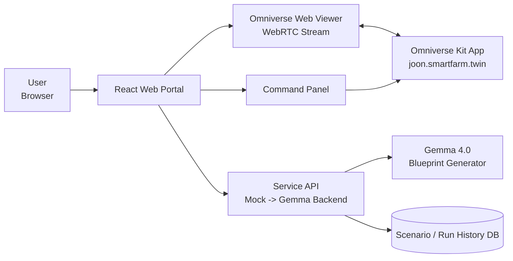
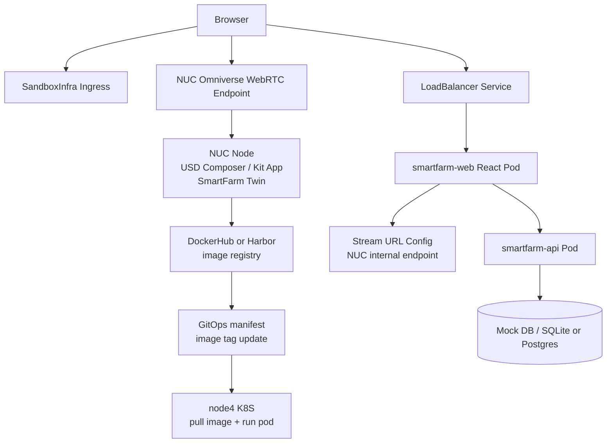
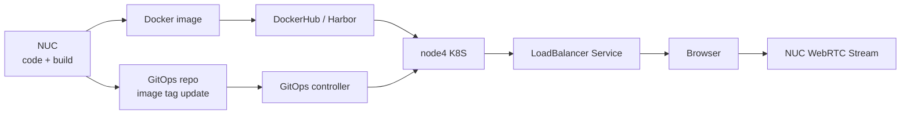
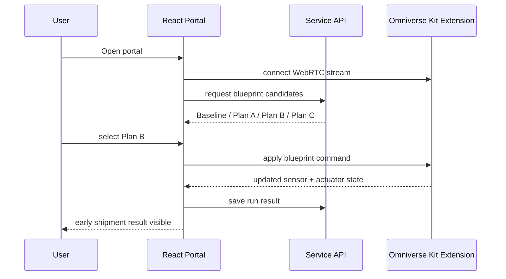

# 2026-05-26 Web Portal 설계

목표:

```text
Omniverse Twin을 연구용 데스크톱 툴이 아니라
실제 서비스처럼 보이는 Web Portal 형태로 제공한다.
```

이번 단계의 핵심은 React 화면을 예쁘게 만드는 것이 아니라,
웹 포털 안에서 다음 흐름이 한 화면에 이어지게 만드는 것이다.

```text
Gemma Blueprint 후보 생성
-> 후보 선택
-> Omniverse Twin에 적용
-> 센서/actuator/예상 출하 결과 확인
```

## 공식 샘플 기준

사용 후보:

```text
NVIDIA Omniverse Web Viewer Sample
  -> React + Vite 기반 web client
  -> Omniverse Kit app 화면을 browser에 streaming
  -> web client와 Kit app 사이 custom message 송수신 가능

NVIDIA OV Web SDK / create-ov-web-rtc-app
  -> WebRTC streaming client를 생성하는 최신 generator 흐름
  -> local / OKAS / NVCF 같은 stream source를 선택 가능
```

참고 링크:

```text
https://github.com/NVIDIA-Omniverse/web-viewer-sample
https://docs.omniverse.nvidia.com/embedded-web-viewer/latest/requirements.html
https://docs.omniverse.nvidia.com/embedded-web-viewer/latest/workflow/streaming-and-messaging.html
https://docs.omniverse.nvidia.com/ov-web-sdk/latest/web-sample/overview.html
```

우리 프로젝트에서는 1차로 다음 방식을 사용한다.

```text
React Portal
  -> Web Viewer Sample / OV WebRTC client를 기반으로 Omniverse stream 표시

Omniverse Kit App
  -> 현재 joon.smartfarm.twin extension 실행
  -> SmartFarm scene / sensor / actuator / demo scenario를 담당

Service API
  -> 초기에는 mock
  -> 이후 Gemma 4.0 blueprint 생성, candidate scoring, scenario 저장 담당
```

## 내가 하려는 서비스 형태

한 문장:

```text
브라우저에서 Omniverse 스마트팜 트윈을 보면서,
Gemma가 제안한 조기 출하 운영 후보를 선택하고,
Twin에서 센서/actuator/성장 결과 변화를 확인하는 포털.
```

## 전체 구조



중요한 분리:

```text
Omniverse stream
  -> 화면, camera, viewport interaction
  -> WebRTC 기반

Service API
  -> blueprint 후보 생성
  -> sensor snapshot 저장
  -> scenario 평가 결과 저장

Kit Extension message
  -> Create Mature Scene
  -> Create Growth Simulation
  -> Run Demo Scenario
  -> Apply Blueprint
  -> Set actuator state
  -> Read virtual sensor state
```

## 배포 전제

사용자가 말한 배포 환경:

```text
Web Portal
  -> ssh joon@10.34.20.3
  -> SandboxInfra Kubernetes에 배포
  -> React portal / Service API만 실행
  -> image는 NUC에서 build/push된 것을 pull해서 실행

Omniverse / USD Composer / Kit App
  -> 현재 NUC 노드에서 실행
  -> SmartFarm Twin 렌더링과 WebRTC stream source 역할
  -> SandboxInfra K8S와 같은 내부망에 있으므로 포털에서 접근 가능

Build / Registry / GitOps
  -> React code 작성, build, Docker image 생성은 NUC에서 진행
  -> Web UI / frontend 구성 코드는 Claude Code가 작성
  -> Codex는 요구사항 정리, 산출물 검증, 문서화, 테스트 결과 확인 담당
  -> image push는 클러스터 내부 Harbor를 먼저 시도
  -> Harbor push 실패 또는 설정 누락 시 DockerHub fallback
  -> node4 Kubernetes는 image를 직접 build하지 않음
  -> 기존 GitOps 환경에 맞춰 manifest image tag만 갱신
  -> node4는 registry에서 image를 pull하고 LoadBalancer 형태로 서비스 노출
```

따라서 1차 POC 네트워크 구조는 다음처럼 잡는다.



주의:

```text
K8S 위에는 웹 포털만 올린다.
Omniverse / USD Composer / Kit App은 K8S에 올리지 않는다.
NUC가 Omniverse 화면을 렌더링하고 stream endpoint를 제공한다.
React Portal은 그 stream endpoint를 받아 브라우저 안에 표시한다.
사용자 입장에서는 K8S 포털 안에서 Omniverse 화면을 보는 것처럼 동작한다.

NUC는 개발/빌드 머신이기도 하다.
React code 작성, npm build, docker build, registry push를 NUC에서 수행한다.
node4 K8S는 GitOps가 지정한 image를 pull해서 실행만 한다.
```

즉 "화면을 K8S 포털로 보낸다"는 의미는 다음과 같다.

```text
NUC Kit App
  -> WebRTC stream 생성

SandboxInfra K8S React Portal
  -> viewer component 제공
  -> NUC stream endpoint URL을 브라우저에 전달

Browser
  -> K8S portal UI를 열고
  -> portal 내부 viewer에서 NUC Omniverse stream을 재생
```

## Build / 배포 흐름

확정된 운영 방식:

```text
NUC
  -> Claude Code로 smartfarm-web React code 작성
  -> Codex가 구조/요구사항/테스트/빌드 결과 검증
  -> npm build
  -> docker build
  -> Harbor에 image push 먼저 시도
  -> 실패 시 DockerHub fallback
  -> GitOps repo의 image tag 갱신

node4 Kubernetes
  -> 기존 GitOps controller가 manifest 변경 감지
  -> registry에서 smartfarm-web image pull
  -> React portal pod 실행
  -> LoadBalancer service로 portal 노출
```

흐름도:



명확한 역할 분리:

```text
NUC
  -> Omniverse 실행
  -> WebRTC stream source
  -> web code build/image push

node4 K8S
  -> React portal runtime
  -> optional Service API runtime
  -> LoadBalancer exposure

Registry
  -> 1순위: 내부 Harbor
  -> 2순위: DockerHub fallback
  -> node4가 pull할 image 보관

GitOps
  -> Kubernetes manifest source of truth
  -> image tag / env config 변경 관리
```

## Web UI 작업 역할 분담

이번 Web Portal 단계에서는 frontend 작성 주체를 Claude Code로 둔다.

```text
Claude Code
  -> React app scaffold 작성
  -> 화면 레이아웃 구현
  -> Omniverse viewer 영역 구성
  -> Blueprint / Sensor / Actuator / Result UI 구현
  -> CSS / component 구조 작성
  -> Dockerfile 초안 작성

Codex
  -> 요구사항과 architecture 문서 정리
  -> Claude가 만든 frontend 코드 검증
  -> build / lint / typecheck / 테스트 실행
  -> Omniverse stream, API, K8S 배포 조건과 맞는지 리뷰
  -> 누락된 요구사항, 위험한 가정, 과한 구현 지적
```

즉, Codex가 Web UI를 직접 디자인/작성하지 않는다.

```text
frontend implementation owner = Claude Code
verification / integration reviewer = Codex
```

## Web 화면 구성

첫 화면은 landing page가 아니라 실제 운영 화면으로 둔다.

```text
┌──────────────────────────────────────────────────────────────┐
│ Header: Smart Farm Early-Shipment Twin                       │
├───────────────┬──────────────────────────────┬───────────────┤
│ Blueprint     │ Omniverse Live Viewer         │ Sensor State  │
│ Candidates    │ - streamed viewport           │ - DLI         │
│ - Baseline    │ - camera / interact           │ - Soil water  │
│ - Plan A      │ - selected scenario visible   │ - Humidity    │
│ - Plan B      │                              │ - Temp / CO2  │
├───────────────┴──────────────────────────────┴───────────────┤
│ Timeline / Run Log / Predicted Shipment / Yield Score         │
└──────────────────────────────────────────────────────────────┘
```

왼쪽 패널:

```text
Blueprint Candidates
  -> Baseline
  -> Gemma Plan A: low cost
  -> Gemma Plan B: early shipment
  -> Gemma Plan C: disease-risk safe
```

중앙:

```text
Omniverse streamed viewport
  -> 현재 SmartFarm Twin 화면
  -> 사용자는 여기서 실제 온실을 눈으로 확인
```

오른쪽 패널:

```text
Virtual Sensor State
  -> DLI
  -> Soil Moisture
  -> Humidity
  -> Temperature
  -> CO2

Actuator State
  -> LED
  -> WaterValve
  -> Fan
```

하단:

```text
Scenario Result
  -> Expected shipment
  -> Yield score
  -> OpEx delta
  -> Risk note
  -> Run history
```

## 서비스 로직

POC에서는 실제 Gemma API 연결 전에 mock으로 먼저 고정한다.



## 최소 데이터 모델

Blueprint:

```json
{
  "id": "plan-b-early-shipment",
  "name": "Early Shipment Plan B",
  "horizon_days": 60,
  "target_shipment_date": "2026-12-22",
  "controls": {
    "led": {
      "photoperiod_hours": 16,
      "intensity_percent": 80
    },
    "irrigation": {
      "target_soil_moisture_percent": 48
    },
    "fan": {
      "duty_percent": 55
    }
  },
  "predicted": {
    "shipment_date": "2026-12-22",
    "yield_score": 87,
    "opex_delta_percent": 18
  }
}
```

Sensor Snapshot:

```json
{
  "dli_mol_m2_day": 11.2,
  "soil_moisture_percent": 31,
  "humidity_percent": 82,
  "temperature_c": 24.8,
  "co2_ppm": 420
}
```

Actuator State:

```json
{
  "led": "on",
  "water_valve": "on",
  "fan": "55%"
}
```

## Omniverse 쪽 message 설계

Web Viewer Sample의 custom message 방향을 우리 extension에 맞게 바꾼다.

필요 command:

```text
smartfarm.create_mature_scene
smartfarm.create_growth_simulation
smartfarm.reset_growth_timeline
smartfarm.apply_blueprint
smartfarm.get_state
```

`smartfarm.apply_blueprint` payload:

```json
{
  "blueprint_id": "plan-b-early-shipment",
  "sensor_target": {
    "dli_mol_m2_day": 17.8,
    "soil_moisture_percent": 48,
    "humidity_percent": 68,
    "temperature_c": 23.6,
    "co2_ppm": 650
  },
  "actuator_target": {
    "led_intensity_percent": 80,
    "water_valve": true,
    "fan_duty_percent": 55
  }
}
```

Kit extension response:

```json
{
  "status": "applied",
  "scene": "smartfarm-v1",
  "sensor_state": {
    "dli_mol_m2_day": 17.8,
    "soil_moisture_percent": 48,
    "humidity_percent": 68,
    "temperature_c": 23.6,
    "co2_ppm": 650
  },
  "result": {
    "expected_shipment": "2026-12-22",
    "yield_score": 87,
    "opex_delta": "+18%"
  }
}
```

## 구현 순서

### Step 1. Web 샘플 단독 실행

```text
목표:
  React Web Viewer Sample을 로컬에서 실행

완료 기준:
  브라우저에서 Omniverse stream 연결 UI가 뜸
```

### Step 2. SmartFarm 전용 React Portal shell 생성

```text
목표:
  web-viewer-sample을 그대로 쓰지 않고
  smartfarm-web 형태의 서비스 UI shell로 정리

포함:
  Omniverse viewer area
  Blueprint candidates panel
  Sensor state panel
  Actuator state panel
  Scenario result panel
```

### Step 3. Kit App streaming 연결

```text
목표:
  현재 joon.smartfarm.twin이 켜진 USD Composer / Kit app 화면을 Web Portal에서 보기

완료 기준:
  웹 중앙 viewer에 현재 2x2 비닐하우스 Twin 화면이 표시됨
```

### Step 4. Mock Blueprint 적용

```text
목표:
  React에서 Plan B 버튼 클릭
  -> Kit extension Run Demo Scenario와 같은 효과 발생

완료 기준:
  LED / WaterValve / Fan / Sensor state가 화면과 UI에서 같이 변함
```

### Step 5. Service API 추가

```text
목표:
  blueprint 후보와 실행 결과를 frontend state가 아니라 API에서 제공

초기 기술 후보:
  FastAPI
  SQLite or Postgres
  WebSocket optional
```

### Step 6. SandboxInfra Kubernetes 배포

```text
목표:
  NUC에서 smartfarm-web image build/push
  GitOps manifest image tag 갱신
  node4 K8S에서 image pull 후 pod 실행
  LoadBalancer service로 portal 노출

전제:
  Omniverse Kit streaming endpoint는 NUC에서 실행
  K8S pod는 포털/API만 담당
  browser 또는 portal이 NUC stream endpoint에 내부망으로 접근 가능
  node4에서 직접 build하지 않음
```

## 현재 결정

```text
1차 구현은 Local/Internal WebRTC streaming 기준.
OKAS/GDN/NVCF는 지금 당장 목표가 아님.

Omniverse / USD Composer / Kit App은 현재 NUC 노드에서 실행한다.
SandboxInfra K8S에는 React Portal과 Service API만 배포한다.
React Portal code 작성은 Claude Code가 담당한다.
Codex는 그 결과물을 검증한다.
build, Docker image push는 NUC에서 진행한다.
image push는 내부 Harbor를 먼저 시도한다.
Harbor push가 실패하거나 설정이 없으면 DockerHub를 fallback으로 사용한다.
node4 K8S는 GitOps 기준으로 image를 pull해서 LoadBalancer로 노출한다.

React Portal은 Omniverse 화면을 포함한 실제 운영 UI로 만든다.
landing page는 만들지 않는다.

Gemma는 처음부터 실제 API로 붙이지 않는다.
먼저 mock Blueprint 후보 3개를 만들고,
UI/Kit message/시나리오 적용 흐름을 검증한다.

이후 mock generator를 Gemma backend로 교체한다.
```

## Claude 자문 반영 사항

Claude Code에 frontend 설계를 요청한 결과, 중요한 구현 순서가 정리되었다.

핵심 지적:

```text
React app보다 먼저 Kit message bridge가 필요하다.
현재 joon.smartfarm.twin은 omni.ui button callback 중심이다.
따라서 Web Portal에서 직접 smartfarm.apply_blueprint / smartfarm.get_state를 호출할 수 없다.
```

따라서 구현 순서를 다음처럼 수정한다.

```text
1. Kit extension 내부 기능을 controller 형태로 분리
2. WebRTC data channel / livestream messaging으로 command를 받는 bridge 추가
3. React Portal은 bridge contract를 기준으로 작성
4. API는 Blueprint 후보 생성 / forecast / scoring / run history를 담당
5. Kit은 API가 넘긴 sensor_target / actuator_target을 렌더링만 담당
```

역할 분리:

```text
Kit / NUC
  -> 현재 Twin scene이 어떻게 보이는지의 source of truth
  -> sensor / actuator visual state rendering

Service API / K8S
  -> Gemma 후보 생성
  -> deterministic forecast
  -> scoring
  -> run history

React Portal / Browser
  -> Omniverse stream 표시
  -> 후보 선택 / 상태 표시 / command trigger
```

중요한 배포 판단:

```text
WebRTC media는 K8S ingress로 proxy하지 않는다.
브라우저가 K8S 포털을 열고,
포털 내부 viewer가 NUC WebRTC endpoint에 직접 연결한다.

K8S ingress / LoadBalancer는 React Portal과 API 노출에만 사용한다.
```

Kit command contract 초안:

```json
{
  "command": "apply_blueprint",
  "request_id": "uuid",
  "payload": {
    "blueprint_id": "plan-b",
    "sensor_target": {
      "dli_mol_m2_day": 17.8,
      "substrate_moisture_percent": 48,
      "humidity_percent": 68,
      "temperature_c": 23.6,
      "co2_ppm": 650,
      "crop_stage": "fruiting_early_harvest",
      "disease_risk": "controlled"
    },
    "actuator_target": {
      "led_intensity_percent": 80,
      "photoperiod_hours": 16,
      "irrigation_pulses_per_day": 3,
      "target_moisture_percent": 48,
      "fan_duty_percent": 55
    }
  }
}
```

Kit state response 초안:

```json
{
  "request_id": "uuid",
  "scene": "smartfarm-v1",
  "sensor": {
    "dli_mol_m2_day": 17.8,
    "substrate_moisture_percent": 48,
    "humidity_percent": 68,
    "temperature_c": 23.6,
    "co2_ppm": 650
  },
  "actuators": {
    "led": {
      "intensity_percent": 80,
      "photoperiod_hours": 16,
      "on": true
    },
    "water_valve": {
      "open": true,
      "target_moisture_percent": 48
    },
    "fan": {
      "duty_percent": 55
    }
  }
}
```

주의:

```text
Expected shipment / yield score / OpEx delta는 Kit이 계산하지 않는다.
이 값들은 Service API가 계산하고 저장한다.
Kit은 선택된 Blueprint 결과를 시각적으로 렌더링한다.
```

## 아직 확정해야 할 것

```text
Omniverse streaming endpoint
  -> NUC에서 어떤 포트로 열 것인가?
  -> WebRTC signaling URL은 무엇인가?

Kit App 실행 방식
  -> NUC에서 USD Composer 그대로 streaming할 것인가?
  -> NUC에서 별도 SmartFarm Kit App을 streaming 모드로 띄울 것인가?

Kubernetes ingress
  -> 내부망 전용인가?
  -> 인증이 필요한가?
  -> NUC stream endpoint를 browser가 직접 접근할지, portal/backend가 proxy할지?
  -> LoadBalancer IP/hostname을 어떤 값으로 쓸 것인가?

Backend
  -> FastAPI로 갈 것인가?
  -> Node API로 단순하게 갈 것인가?

Registry
  -> 내부 Harbor endpoint / project 이름은 무엇인가?
  -> DockerHub fallback repository는 무엇인가?
  -> image tag 규칙은 0.1.0 고정인지 날짜/commit sha 기반인지?

GitOps repo
  -> manifest가 어느 repo/path에 있는가?
  -> image tag는 kustomize image patch로 바꿀 것인가?
  -> Helm values로 바꿀 것인가?
```

## 다음 작업

바로 다음 단계는 설계 논쟁이 아니라 연결 검증이다.

```text
1. Codex가 Claude에게 frontend 구현 요구사항 prompt 작성
2. Claude Code가 NUC에서 web-viewer-sample 또는 create-ov-web-rtc-app 기반 React client 생성
3. Claude Code가 NUC 내부망 stream URL을 portal runtime config로 주입
4. Claude Code가 SmartFarm Portal layout과 mock Blueprint UI 작성
5. Codex가 frontend 구조, build, typecheck, 요구사항 충족 여부 검증
6. Kit bridge가 준비되면 Claude Code가 버튼 클릭 -> Kit command 연결
7. NUC에서 docker build/push
   -> Harbor 먼저
   -> 실패 시 DockerHub fallback
8. GitOps manifest image tag 갱신
9. node4 K8S에서 LoadBalancer service로 portal 확인
```

## 2026-05-26 구현 반영

이번 단계에서 실제로 만들어진 산출물:

```text
web/smartfarm-web/
  React + Vite + TypeScript 포털
  Claude Code가 frontend component 작성
  Codex가 typecheck/build 검증

web/smartfarm-web/scripts/build-and-push-image.sh
  NUC에서 실행하는 image build/push script
  Harbor를 먼저 시도
  실패하거나 설정이 없으면 DockerHub fallback

web/smartfarm-web/deploy/k8s/smartfarm-web.yaml
  GitOps repo로 옮겨 쓸 수 있는 LoadBalancer 배포 템플릿
  ConfigMap으로 NUC stream endpoint 주입
```

검증 결과:

```text
npm run typecheck
  -> 통과

npm run build
  -> 통과
  -> dist 생성 완료
```

아직 실제 push / K8S 반영은 하지 않았다.

이유:

```text
현재 쉘에 HARBOR_REGISTRY / HARBOR_PROJECT / DOCKERHUB_REPOSITORY 값이 없음
현재 작업 쉘에서 docker CLI가 없음
docker login 상태와 내부 Harbor endpoint도 아직 확인 필요
GitOps repo/path도 아직 미정
```

## 2026-05-26 추가 진행: NUC streaming endpoint

정정:

```text
현재 NUC 노드
  -> joon-NUC12DCMv7
  -> IP: 10.34.21.100

기존 portal config
  -> 10.34.20.10
  -> 잘못된 이전 주소
```

NUC에서 수행한 일:

```text
source/apps/joon.smartfarm_composer_streaming.kit 추가
  -> Smart Farm USD Composer를 streaming 모드로 실행하는 Kit app layer

repo.toml precache app 목록에 streaming kit 추가

./repo.sh build -u 실행
  -> omni.kit.livestream.app-10.1.1 설치
  -> omni.kit.livestream.webrtc-10.3.2 설치
  -> version lock 재생성
```

실행 상태:

```text
Streaming Kit PID
  -> 848034

열린 포트
  -> 8011  : Kit service / docs
  -> 49100 : Omniverse livestream signaling

확인:
  curl http://10.34.21.100:8011/docs
    -> 200 OK

  nc -vz 10.34.21.100 49100
    -> succeeded
```

K8S portal runtime config 반영:

```text
ConfigMap smartfarm-web-config 수정
  stream.server    = 10.34.21.100
  stream.streamUrl = http://10.34.21.100:8011
  mediaPort        = 49100

deployment/smartfarm-web rollout restart 완료

LoadBalancer
  -> http://10.34.25.13

확인:
  curl http://10.34.25.13/
    -> 200 OK

  curl http://10.34.25.13/config.json
    -> 10.34.21.100 값 반영 확인
```

중요:

```text
NUC streaming source는 이제 살아있다.

하지만 web/smartfarm-web의 OmniverseViewport는 아직 placeholder다.
즉, Connect stream 버튼은 실제 WebRTC client가 아니라 mock 상태 전환만 수행한다.

다음 단계:
  NVIDIA web-viewer-sample 또는 create-ov-web-rtc-app 기반 client를
  React viewer에 통합해야 실제 영상이 중앙 viewer에 표시된다.
```

## 2026-05-27 정정: WebRTC client URL 오해 해결

문제:

```text
사용자가 열었던 주소
  http://10.34.21.100:8011/streaming/webrtc-client/

결과
  404 Not Found
```

원인:

```text
8011
  -> Kit services / docs / health API
  -> 브라우저 viewer HTML을 제공하는 주소가 아님

49100
  -> Omniverse livestream signaling port
  -> 실제 WebRTC client가 붙어야 하는 포트

즉,
  /streaming/webrtc-client/ 라는 페이지가 존재하지 않는다.
```

검증:

```text
curl -i http://10.34.21.100:8011/streaming/webrtc-client/
  -> HTTP/1.1 404 Not Found

curl http://10.34.21.100:8011/openapi.json
  -> Kit services core route만 존재

nc -vz 10.34.21.100 49100
  -> succeeded
```

공식 client 확인:

```text
NVIDIA-Omniverse/web-viewer-sample clone
  -> stream.config.json local.server = 10.34.21.100
  -> signalingPort = 49100
  -> npm install 성공
  -> Vite client 실행 확인
```

포털 반영:

```text
web/smartfarm-web/src/features/viewer/OmniverseViewport.tsx
  -> mock timer 제거
  -> @nvidia/omniverse-webrtc-streaming-library AppStreamer.connect 사용
  -> video id remote-video
  -> audio id remote-audio
  -> local direct streaming: server=10.34.21.100, signalingPort=49100

web/smartfarm-web/.npmrc
  -> @nvidia registry 추가

web/smartfarm-web/public/config.json
  -> signalingPath 제거
  -> mediaPort 제거

web/smartfarm-web/deploy/k8s/smartfarm-web.yaml
  -> signalingPath 제거
  -> mediaPort 제거
```

현재 검증:

```text
npm install
  -> 성공
  -> npm 버전 경고만 있음

npm run typecheck
  -> 성공

npm run build
  -> 성공
  -> bundle size warning만 있음
```

주의:

```text
지금 바로 볼 수 있는 로컬 포털 preview
  -> http://10.34.21.100:4173

K8S LoadBalancer 포털
  -> 새 image build/push/deploy 전까지는 이전 bundle일 수 있음

docker 명령
  -> 현재 NUC shell에서 docker command not found
  -> K8S 배포 image 갱신은 docker/podman/buildkit 환경 확인 필요
```
